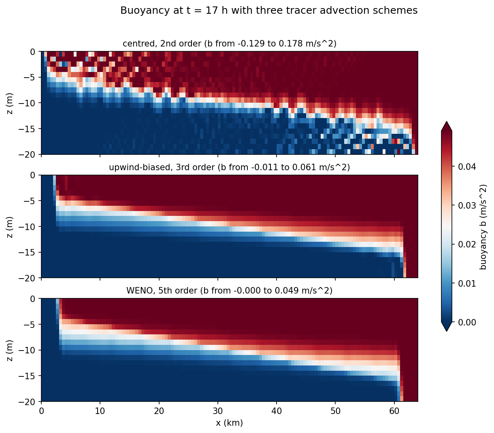
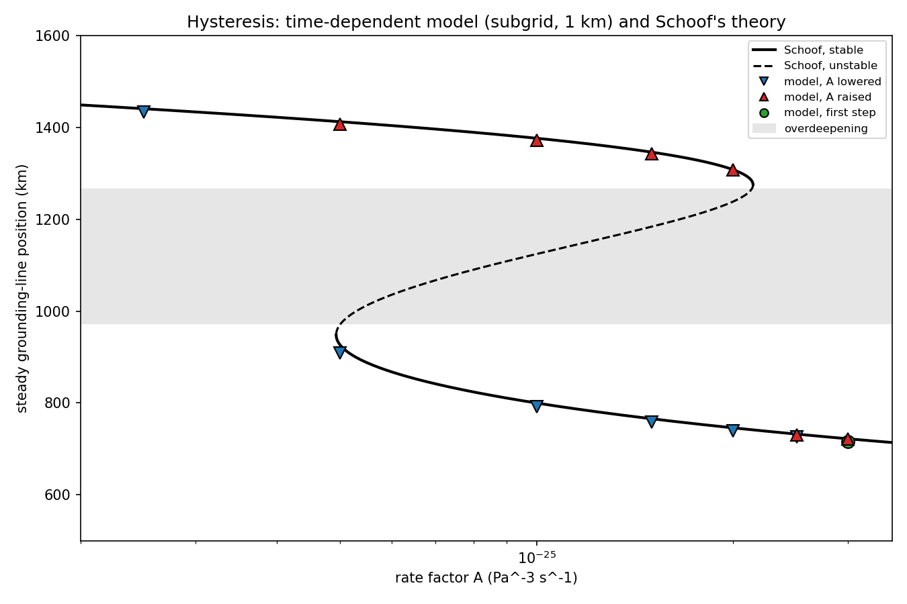
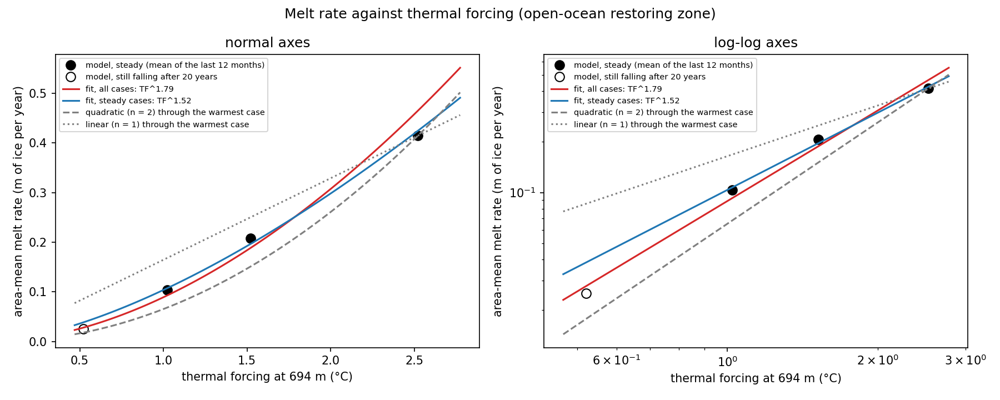
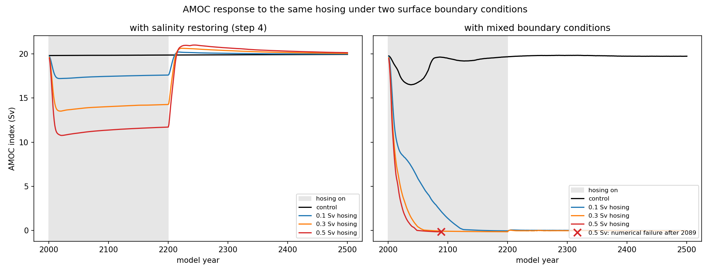
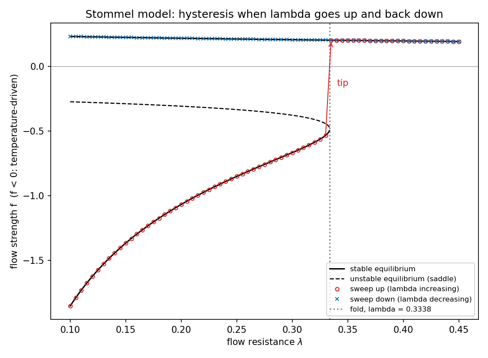
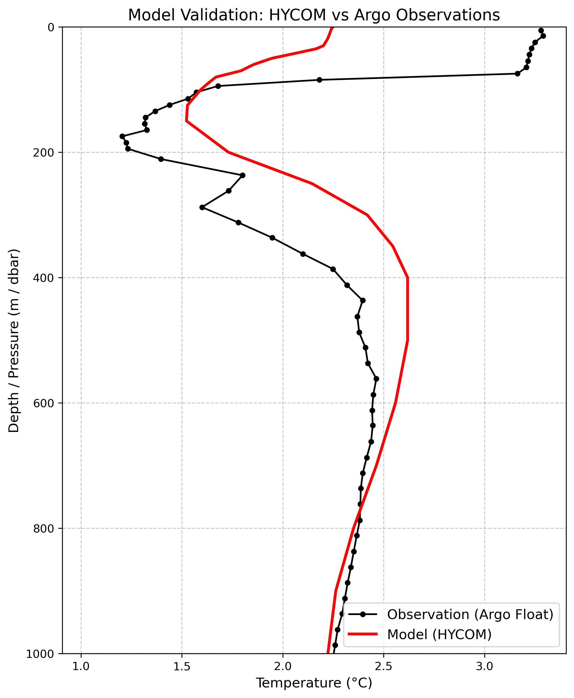
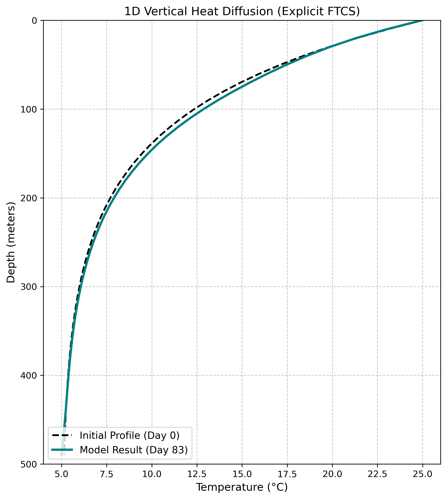
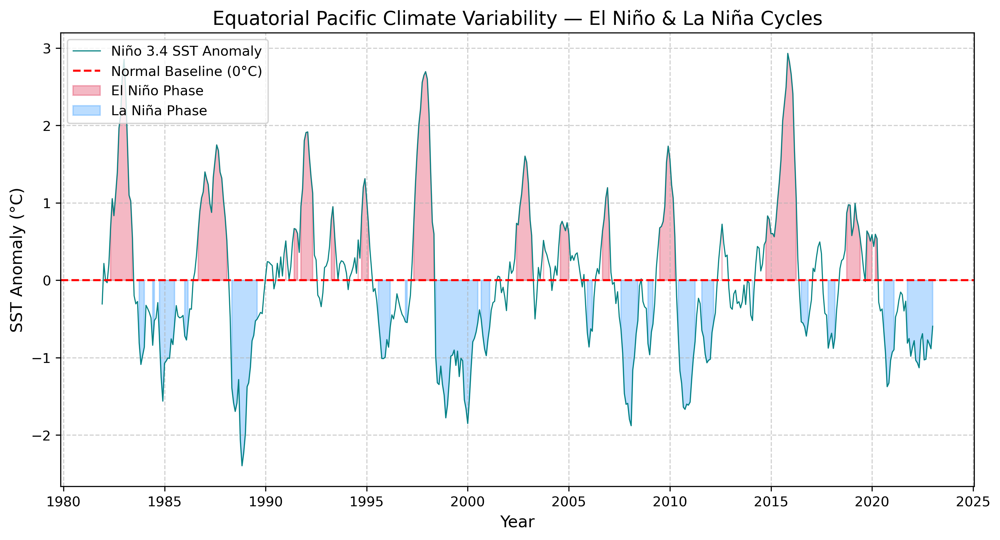

# Ocean Science Projects

I am an environmental engineer (M.Tech, IIT Roorkee) moving into physical oceanography. This repository holds projects in Python, MITgcm,Julia(Oceananigans.jl) mainly working with ocean observations and model output through xarray, NetCDF and OPeNDAP. Each project folder has its own README describing the data, method and what the saved output shows.

---

## Featured projects

<table>
<tr>
<td width="33%" valign="top">
<a href="project_18_oceananigans_numerical_mixing/"></a><br>
<b><a href="project_18_oceananigans_numerical_mixing/">18. Numerical mixing in Oceananigans.jl</a></b><br>
Runs the lock-exchange test of Ilicak et al. (2012) in Oceananigans.jl with zero explicit diffusivity, so any mixing comes from the numerics, and varies the tracer scheme, grid, viscosity and time step over 34 runs.
The centred tracer scheme creates water outside the starting buoyancy range and WENO does not; a 16 times finer grid cuts WENO's mixing by only a factor of 1.6.
</td>
<td width="33%" valign="top">
<a href="project_17_marine_ice_sheet_flowline/"></a><br>
<b><a href="project_17_marine_ice_sheet_flowline/">17. Marine ice-sheet flowline model</a></b><br>
A 1D shallow-shelf ice-flow model written in Python, run on the MISMIP experiment 3 bed to reproduce the marine ice-sheet instability of Schoof (2007).
The grounding line jumps across the overdeepening with hysteresis, as Schoof predicts. At 0.5 km spacing a plain grid still puts it 30 km short of his position; a sub-grid scheme cuts that to 4 km.
</td>
<td width="33%" valign="top">
<a href="project_16_mitgcm_ice_shelf_cavity/"></a><br>
<b><a href="project_16_mitgcm_ice_shelf_cavity/">16. Ice-shelf cavity melting in MITgcm</a></b><br>
Runs MITgcm's isomip ice-shelf cavity with the far-field ocean held 0.5-2 °C warmer, and sets up ISOMIP+ Ocean0 from its specification.
Melt grows like thermal forcing to the power of about 1.5, and the density of the warm water decides whether it reaches the deep grounding line.
</td>
</tr>
<tr>
<td width="33%" valign="top">
<a href="project_15_mitgcm_freshwater_hosing/"></a><br>
<b><a href="project_15_mitgcm_freshwater_hosing/">15. Freshwater hosing in MITgcm</a></b><br>
Adds 0.1-0.5 Sv of freshwater to the subpolar North Atlantic in a 4° global MITgcm ocean, under two surface boundary conditions for salinity.
With salinity restoring the AMOC weakens and recovers; with mixed boundary conditions it collapses and stays off.
</td>
<td width="33%" valign="top">
<a href="project_14_tipping_box_models/"></a><br>
<b><a href="project_14_tipping_box_models/">14. Tipping points in box models</a></b><br>
Uses the Stommel (1961) and Cessi (1994) box models to show two stable overturning states, a fold with hysteresis, and noise-driven flips whose waiting times scale as Kramers' law predicts.
Before tipping, the variance and autocorrelation of the fluctuations rise, as linear theory predicts.
</td>
<td width="33%" valign="top">
<a href="project_07_hycom_argo_comparison/"></a><br>
<b><a href="project_07_hycom_argo_comparison/">07. HYCOM vs Argo temperature profile</a></b><br>
Compares an Argo temperature profile (Southern Ocean, January 2013) with HYCOM at the nearest grid point, over 0–1000 m.
The model time is not matched to the float date, so the comparison is qualitative.
</td>
</tr>
<tr>
<td width="33%" valign="top">
<a href="project_09_1d_diffusion_model/"></a><br>
<b><a href="project_09_1d_diffusion_model/">09. 1D vertical heat diffusion model</a></b><br>
Solves ∂T/∂t = κ ∂²T/∂z² with an explicit FTCS scheme (Δz = 10 m, Δt = 1 h, κ = 10⁻⁴ m² s⁻¹) for 83 days.
The surface boundary has a seasonal temperature cycle and the bottom is held at 5 °C (Dirichlet conditions at both ends).
</td>
<td width="33%" valign="top">
<a href="project_08_climate_variability/"></a><br>
<b><a href="project_08_climate_variability/">08. Niño 3.4 SST anomalies</a></b><br>
An area-weighted Niño 3.4 SST anomaly series from NOAA OISST monthly data, 1981–2022.
Months beyond ±0.5 °C are shaded. The largest warm anomalies are in 1982–83, 1997–98 and 2015–16.
</td>
</tr>
</table>

---

## All projects

Projects 11–13 use **synthetic (analytic) data** to practise a method. They do not analyse observations.

| Project | Domain | Description |
| :--- | :--- | :--- |
| [01. Argo Temperature Profile](project_01_argo_hydrography/) | In Situ Observations | Downloads an Argo float profile file (NetCDF) and plots the temperature–pressure profile of one dive. |
| [02. Gulf Stream SST Map](project_02_gulf_stream_sst/) | Satellite Observations | Maps one day of NOAA OISST SST off the US East Coast, accessed via OPeNDAP, showing the Gulf Stream SST front. |
| [03. MODIS-Aqua Chlorophyll-a](project_03_satellite_oceanography/) | Ocean Colour | Maps one 8-day MODIS-Aqua chlorophyll-a composite (June 2021) over the Arabian Sea from an ERDDAP subset. |
| [04. Western Pacific Bathymetry](project_04_bathymetry_gis/) | Bathymetry | Maps ETOPO 2022 depths from Japan to the Mariana Trench, accessed via OPeNDAP. |
| [05. HYCOM Surface Currents](project_05_coastal_hydrodynamics/) | Model Output Analysis | Maps HYCOM model surface currents (u, v, speed) in the Florida Straits for one model time step. |
| [06. Drag-Law Stress from Surface Currents](project_06_surface_drag_stress/) | Coastal Engineering (exercise) | Applies τ = ρC_d\|u\|² to HYCOM *surface* currents off Cape Hatteras and flags τ ≥ 0.18 N m⁻². A method exercise, not a bed-stress estimate. |
| [07. HYCOM vs Argo Temperature](project_07_hycom_argo_comparison/) | Model–Observation Comparison | Compares HYCOM and Argo temperature profiles at the float's location. Not matched in time. |
| [08. Niño 3.4 SST Anomalies](project_08_climate_variability/) | Climate Variability | Area-weighted Niño 3.4 monthly SST anomalies from NOAA OISST (an observational analysis product), with months beyond ±0.5 °C shaded. |
| [09. 1D Diffusion Model](project_09_1d_diffusion_model/) | Numerical Methods | Explicit FTCS finite-difference solution of 1D vertical heat diffusion with Dirichlet boundaries. |
| [10. One-Month-Ahead SST Prediction](project_10_ml_forecast/) | Machine Learning | Random Forest predicting monthly SST off California from lag-1 and lag-2 SST plus the calendar month (test R² = 0.888, RMSE = 0.576 °C). |
| [11. Geostrophy from Synthetic SSH](project_11_synthetic_geostrophy/) | Ocean Dynamics (synthetic) | Computes geostrophic velocity and kinetic energy from an idealised SSH field with a front and two eddies. |
| [12. Marine Heatwave Detection](project_12_marine_heatwaves/) | Climate Extremes (synthetic) | Applies a simplified Hobday et al. threshold method to a synthetic 30-year daily SST series and recovers the injected event. |
| [13. AOU from Synthetic BGC Profiles](project_13_synthetic_bgc_profiles/) | Biogeochemistry (synthetic) | Plots idealised chlorophyll, nitrate and oxygen profiles and computes AOU using a placeholder O₂ saturation formula. |
| [14. Tipping Points in Box Models](project_14_tipping_box_models/) | Ocean Dynamics (conceptual models) | Stommel (1961) and Cessi (1994) box models: equilibria and their stability, a fold with hysteresis, noise-driven flips compared with Kramers' law, and early warning signals before tipping, plus an exploratory toy model of an Antarctic ice-shelf margin. |
| [15. Freshwater Hosing in MITgcm](project_15_mitgcm_freshwater_hosing/) | Ocean Modelling (MITgcm) | 4° global MITgcm runs with 0.1-0.5 Sv of North Atlantic freshwater hosing. Under salinity restoring the AMOC weakens and recovers; under mixed boundary conditions it collapses and stays off. Includes reference-run, hosing-total and salt-budget checks. Shell scripts build and run the model; the analysis is in notebooks. |
| [16. Ice-Shelf Cavity Melting in MITgcm](project_16_mitgcm_ice_shelf_cavity/) | Ocean Modelling (MITgcm) | Ice-shelf cavity runs (isomip, pkg/shelfice) with the far-field ocean 0.5-2 °C warmer: melt grows like thermal forcing^1.5, and the extra melt is mostly at the ice front, because the light warm water cannot reach the deep grounding line. Tests the melt-formula settings and the grid, checks the salt budget, and calibrates ISOMIP+ Ocean0 at 4 km to its 30 m/yr target. |
| [17. Marine Ice-Sheet Flowline Model](project_17_marine_ice_sheet_flowline/) | Ice-Sheet Modelling (own Python model) | A 1D shallow-shelf flowline model on the MISMIP experiment 3 bed. It follows the two stable grounding-line branches of Schoof (2007) and jumps across the overdeepening only past the folds, so for four values of the rate factor A the steady state depends on history; each jump takes 5800-7500 years. Measures the grid dependence from 8 to 0.5 km: at 0.5 km a plain grid is still 30.4 km short of Schoof's position, a sub-grid scheme 4.2 km. Includes velocity-solver, mass and unit checks. |
| [18. Numerical Mixing in Oceananigans.jl](project_18_oceananigans_numerical_mixing/) | Ocean Modelling (Oceananigans.jl) | 2D lock-exchange test (Ilicak et al. 2012) with zero explicit diffusivity, so all mixing is numerical, measured by reference potential energy, buoyancy variance and overshoots over 34 runs. The centred tracer scheme creates new water masses and WENO does not; a 16 times finer grid (2000 to 125 m) cuts WENO mixing only 1.6 times; mixing falls once the grid Reynolds number is below about 25; beyond CFL 1 the overshoots grow and from CFL 2.5 the run blows up. Simulations in Julia; analysis in Python notebooks. |

---

## Tools

- **Language:** Python, Julia (project 18)
- **Data access:** OPeNDAP / THREDDS, ERDDAP, NetCDF (netCDF4, xarray)
- **Analysis:** NumPy, SciPy, pandas, xarray, scikit-learn
- **Plotting:** Matplotlib, Cartopy
- **Ocean models:** MITgcm (projects 15, 16), Oceananigans.jl (project 18)
- **Environment:** conda (conda-forge), JupyterLab, Git; the Julia package manager for project 18

---

## How to run

1. Create and activate the environment (requires conda, e.g. [Miniforge](https://github.com/conda-forge/miniforge)):

   ```bash
   conda env create -f environment.yml
   conda activate ocean-portfolio
   ```

2. Launch JupyterLab from the repository root:

   ```bash
   jupyter lab
   ```

3. Open a notebook from a project's `notebooks/` folder. Paths inside the notebooks are relative (`../data`, `../figures`). The notebooks record a kernel named `ocean`. If Jupyter asks, select the kernel for the `ocean-portfolio` environment. You can register that kernel with `python -m ipykernel install --user --name ocean-portfolio`.

**Projects with their own model.** Projects 15 and 16 need MITgcm built with `gfortran`, and project 18 needs Julia with Oceananigans.jl. Their model runs are stored outside the repository. Each project's README lists the build and run steps.

**Internet access.** Several notebooks read remote data. Remote servers and dataset URLs can change over time.

## Author

**Ojash Giri** · GitHub: [@ojashgiri42](https://github.com/ojashgiri42)
