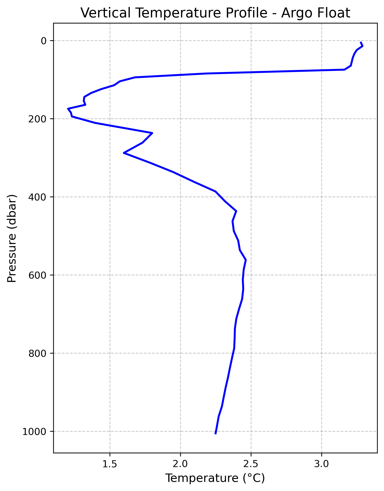

# 01. Argo Temperature Profile

**Question.** What does the vertical temperature structure look like in a single Argo float profile?

**Data.** Argo float 6901814 profile file (`6901814_prof.nc`, Coriolis DAC via the Ifremer GDAC). Only the first profile (`N_PROF=0`) is used: 2013-01-10, 61.50°S, 178.66°E (Southern Ocean), 0–~1000 dbar.

**Method.** Download the float's profile file with `urllib`, open it with xarray, and plot `TEMP` against `PRES` for the first profile. No QC flags are applied, and no T–S diagram or mixed layer depth is computed.

**Finding.** Temperature is about 3.2–3.3 °C in the upper ~80 dbar, drops sharply to a minimum of about 1.2 °C near 170–190 dbar, rises to about 2.4–2.5 °C near 450–600 dbar, and then decreases slowly to about 2.2 °C at 1000 dbar (read from the saved figure). This pattern is consistent with a subsurface temperature-minimum layer.

**How to run.** Open `notebooks/01_argo_analysis.ipynb`. The Argo file is already in `data/`. It is downloaded from the Ifremer server only if it is missing. Create the environment from the repository's `environment.yml` first (see the top-level README). Run notebooks from their `notebooks/` folder, because paths are relative (`../data`, `../figures`).
