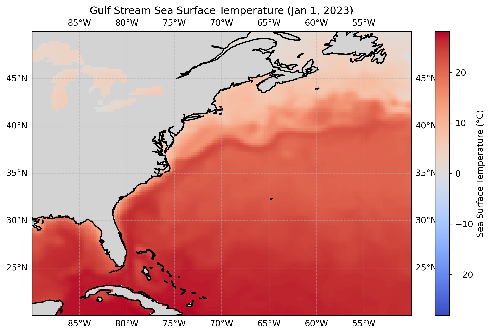

# 02. Gulf Stream SST Map

**Question.** How does the Gulf Stream appear in a single day of sea surface temperature?

**Data.** NOAA OISST high-resolution daily SST accessed via OPeNDAP from the NOAA PSL THREDDS server. Region 20–50°N, 90–50°W. Date: 2023-01-01.

**Method.** Open the remote dataset with xarray, subset one day and the region, and map SST with Cartopy.

**Finding.** A sharp SST front runs northeastward from the shelf near Cape Hatteras (~35°N) and extends eastward near 38–40°N, separating warm subtropical water from colder shelf and slope water.

