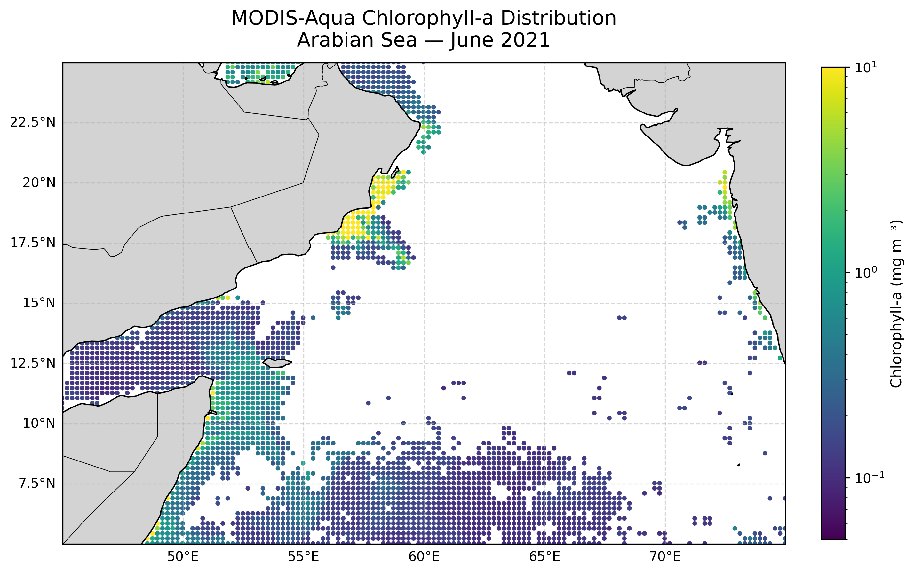

# 03. MODIS-Aqua Chlorophyll-a in the Arabian Sea

**Question.** How is surface chlorophyll-a distributed across the Arabian Sea in early June 2021?

**Data.** NOAA OceanWatch (PIFSC) ERDDAP dataset `aqua_chla_8d_2018_0` (MODIS-Aqua 8-day composite chlorophyll-a). Time stamp 2021-06-02. Region 5–25°N, 45–75°E, subsampled with a stride of 5 grid points.

**Method.** Requested a CSV subset from ERDDAP, drop missing and non-positive values, and plot the points on a log colour scale with Cartopy. This is a single snapshot, so no temporal variability is analysed.

**Finding.** Of 14,065 grid points returned, 2,757 have valid chlorophyll-a. Median 0.155 mg m⁻³, mean 0.76 mg m⁻³, maximum 72.0 mg m⁻³ (printed output). The highest values lie along the coast of Oman (~17–20°N) and the northwest coast of India. Large areas have no valid data, most likely cloud gaps.

