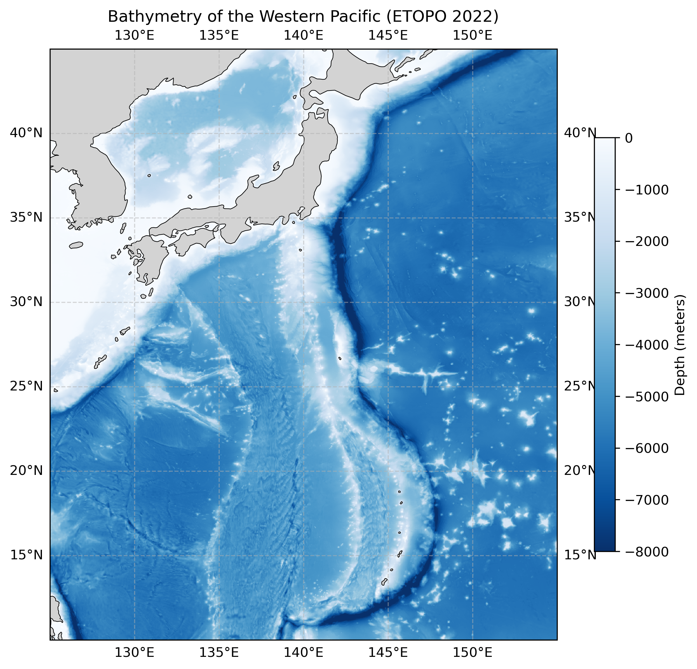

# 04. Western Pacific Bathymetry

**Question.** What are the main seafloor features between Japan and the Mariana Islands?

**Data.** ETOPO 2022 (60 arc-second, bedrock elevation), accessed via OPeNDAP from the NOAA NCEI THREDDS server. Region 10–45°N, 125–155°E.

**Method.** Subset the elevation grid, mask land (elevation ≥ 0), and map depth with `pcolormesh`. The colour scale is clipped at 8000 m.

**Finding.** The Japan, Izu–Bonin and Mariana trenches appear as the deepest features, forming a continuous arc east of the Izu–Bonin–Mariana ridge. Because the colour scale stops at 8000 m, the deepest trench values are not resolved in colour.

