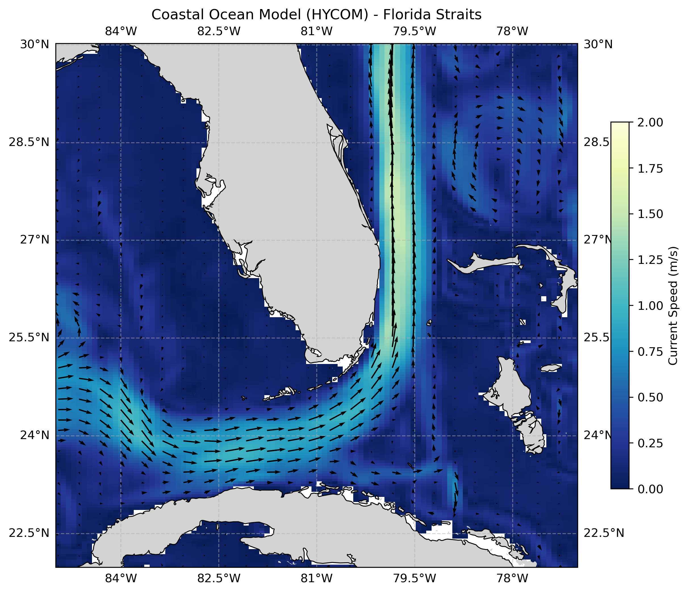

# 05. HYCOM Model Surface Currents, Florida Straits

**Question.** What does the HYCOM model surface current field look like in the Florida Straits?

**Data.** HYCOM global analysis `GLBy0.08/expt_93.0`, accessed via OPeNDAP from the HYCOM THREDDS server. Surface level (`depth=0`), 22–30°N, 85–77°W. First time step of the dataset (`isel(time=0)`

**Method.** Read the model velocity components `water_u` and `water_v`, compute speed √(u²+v²), and map speed with quiver arrows. These are model surface currents and geostrophic velocity or kinetic energy is not computed.

**Finding.** Surface speed is highest (roughly 1.25–1.5 m/s) in the Florida Current core between Florida and the Bahamas. The flow enters from the west along the northern side of Cuba (read from the saved figure).

