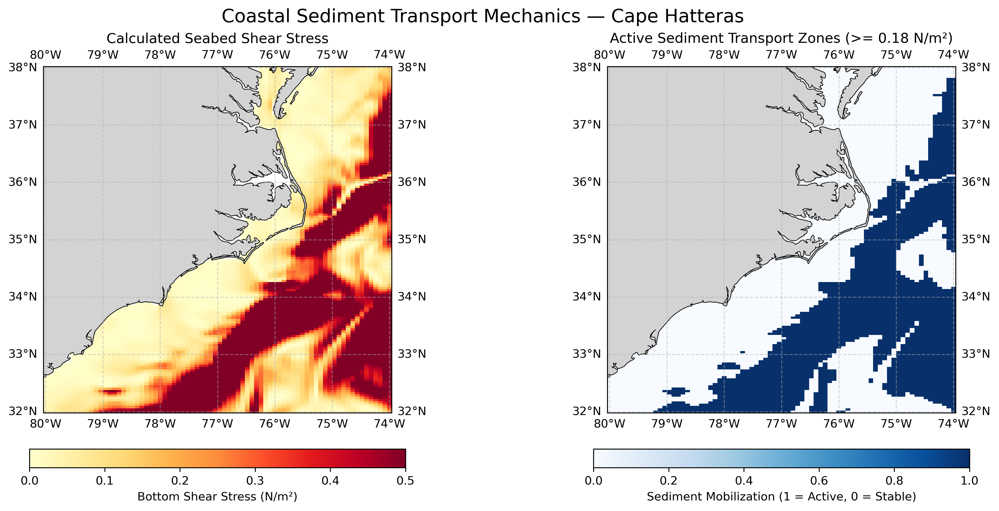

# 06. Drag-Law Stress from HYCOM Surface Currents, Cape Hatteras

**Question.** Where does a quadratic drag law, applied to model surface currents, exceed a typical sand-mobilisation threshold?

**Data.** HYCOM global analysis `GLBy0.08/expt_93.0` via OPeNDAP. Surface level (`depth=0`), 32–38°N, 80–74°W.

**Method.** Compute τ = ρ·C_d·|u|² with ρ = 1025 kg m⁻³ and C_d = 0.0025, using **surface** current speed, and flag cells where τ ≥ 0.18 N m⁻². Surface currents are not near-bed currents, so the values are not an estimate of actual bed shear stress. No sediment transport is computed.

**Finding.** Values above 0.18 N m⁻² follow the Gulf Stream path offshore of the shelf, not the shelf itself. This shows the stress reflects the surface current pattern rather than bottom conditions.

