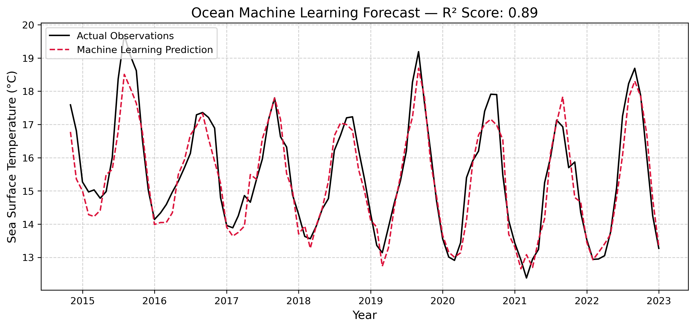

# 10. One-Month-Ahead SST Prediction with a Random Forest

**Question.** How well can a Random Forest predict monthly SST one month ahead from the two previous months and the calendar month?

**Data.** NOAA OISST v2 monthly mean SST (1°) via OPeNDAP from NOAA PSL, at the grid point nearest 35°N, 125°W (off California).

**Method.** Features: calendar month, SST lagged by 1 month, and SST lagged by 2 months. Target: SST (absolute, not anomaly). The first 80 % of the record is used for training and the last 20 % for testing (chronological split, no shuffling), with `RandomForestRegressor(n_estimators=100)`. No persistence or climatology baseline is computed.

**Finding.** On the test period (about late 2014 to end-2022), R² = 0.888 and RMSE = 0.576 °C (printed output). Much of the R² likely comes from the seasonal cycle.

