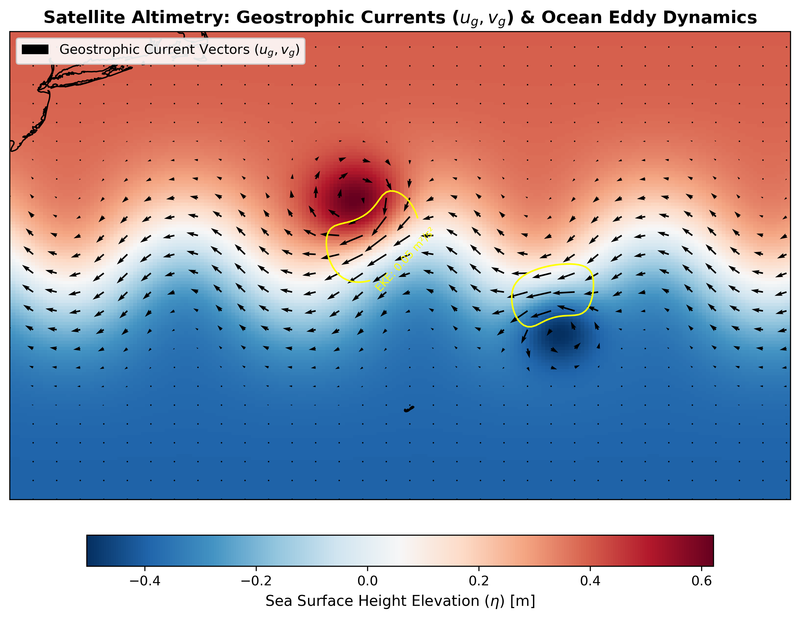

# 11. Geostrophic Velocity from a Synthetic SSH Field

**Question.** What geostrophic velocity field follows from an idealised sea surface height field with a front, a meander and two eddies?

**Data.** **Synthetic.** No satellite altimetry data is used. SSH is built analytically on a 150 × 200 grid covering 30–42°N, 75–55°W. It combines a tanh front, a sinusoidal meander, one positive (anticyclonic) and one negative (cyclonic) Gaussian eddy.

**Method.** Compute u_g = −(g/f) ∂η/∂y and v_g = (g/f) ∂η/∂x with centred differences (`np.gradient`), using f = 2Ω sin φ and metric grid spacing. The notebook labels ½(u_g² + v_g²) as EKE. Because no time mean is removed, this is the kinetic energy per unit mass of the total geostrophic flow, not eddy kinetic energy.

**Finding.** The computed velocities follow SSH contours, as geostrophic balance requires. However, the prescribed front has higher SSH on its north side (about +0.4 m) than on its south side (about −0.4 m). That is the reverse of the real Gulf Stream, so the frontal jet here flows westward. The labelled "EKE" contour (0.05 m² s⁻²) sits where the eddies meet the front.

