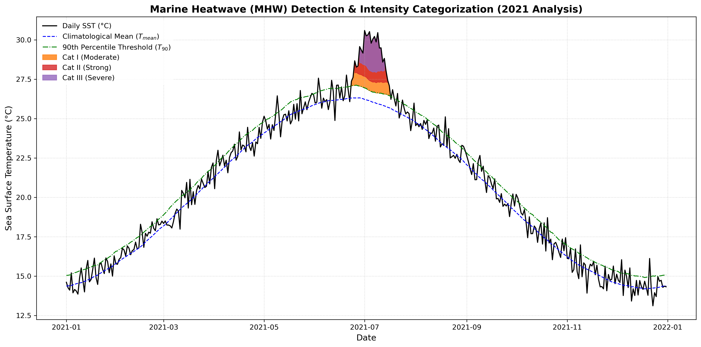

# 12. Marine Heatwave Detection on a Synthetic SST Series

**Question.** Can a Hobday et al. (2016) style threshold method recover a known warm event in a synthetic SST series?

**Data.** **Synthetic.** A daily series for 1993–2022 is built from a sinusoidal seasonal cycle, a linear trend of 0.015 °C per year, Gaussian noise (σ = 0.6 °C, fixed seed), and an injected warm anomaly (peak 4.2 °C) from 15 June to 25 July 2021.

**Method.** Compute the day-of-year climatological mean and 90th percentile over the full series and smooth both with an 11-day running mean. Flag days above the 90th percentile and keep runs of 5 days or more as events. Category bands follow Hobday et al. (2018): multiples of (threshold − mean) above the threshold. This is a simplified version of the method; for example, percentiles are not computed from an 11-day pooled window.

**Finding.** The method detects 1 event in the 30-year series (printed output), and it coincides with the injected June–July 2021 anomaly. At its peak the event reaches the Category III (Severe) band.

