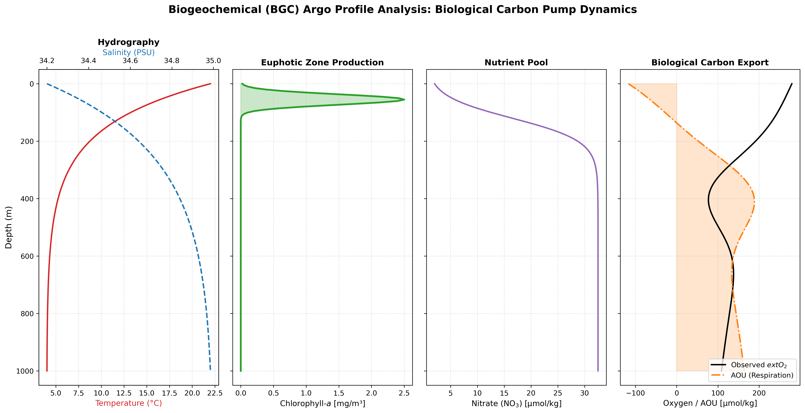

# 13. Apparent Oxygen Utilisation from Synthetic Biogeochemical Profiles

**Question.** How are chlorophyll, nitrate, oxygen and AOU typically arranged in the upper 1000 m, illustrated with idealised profiles?

**Data.** **Synthetic.** No BGC-Argo data is used. Analytic profiles of temperature, salinity, chlorophyll-a, nitrate and dissolved oxygen are defined on 200 levels from 0 to 1000 m.

**Method.** Compute AOU = O₂,sat − O₂. O₂,sat uses a simple linear placeholder (350 − 6.2·T − 1.5·S µmol kg⁻¹), not the Garcia & Gordon (1992) solubility equation that the code comment names. Plot four panels of vertical profiles. No carbon export or remineralisation rate is computed.

**Finding.** By construction, the chlorophyll maximum is at 55 m, nitrate rises through ~50–250 m, and AOU peaks near 400 m at about 190 µmol kg⁻¹, where the prescribed oxygen minimum sits (read from the saved figure). Near the surface, AOU is about −120 µmol kg⁻¹. That strong supersaturation is unrealistic and comes from the placeholder saturation formula. All features follow from the chosen analytic functions, not from observations. TODO(Ojash): replace the placeholder with the Garcia & Gordon (1992) equation (e.g., via the `gsw` package), or use a real BGC-Argo profile.

