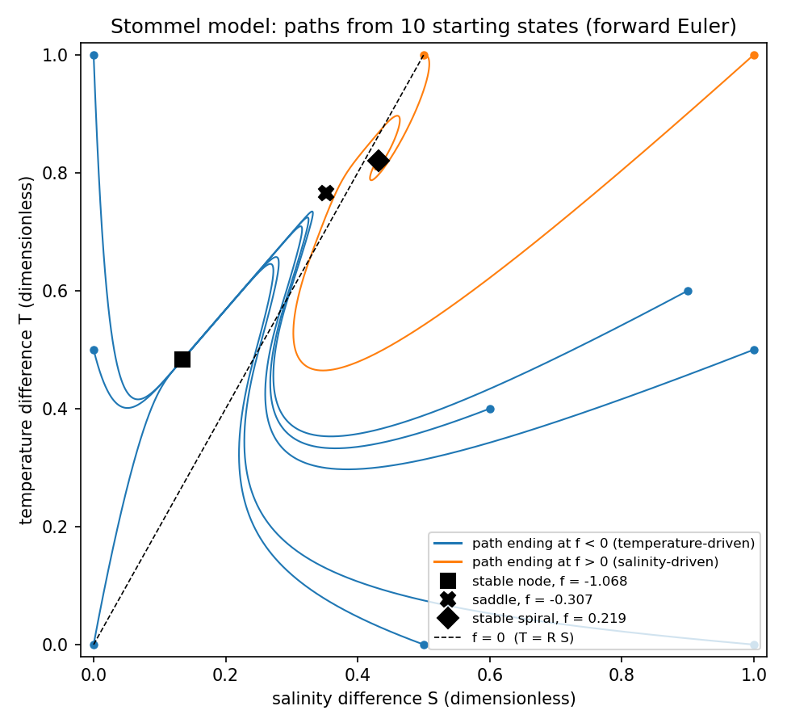
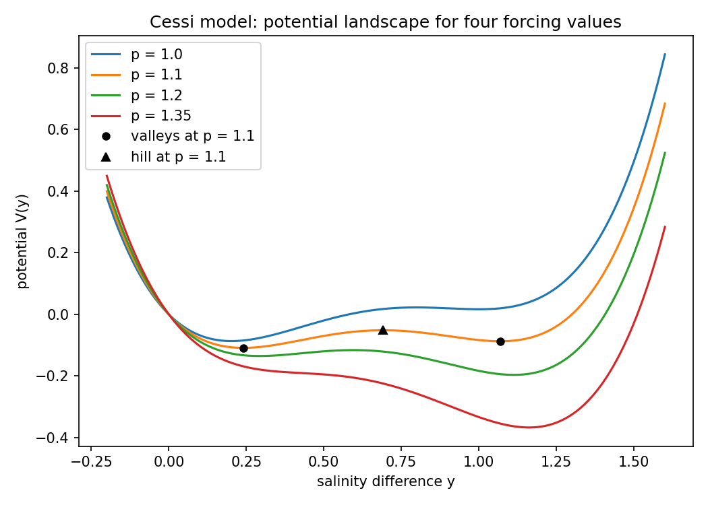
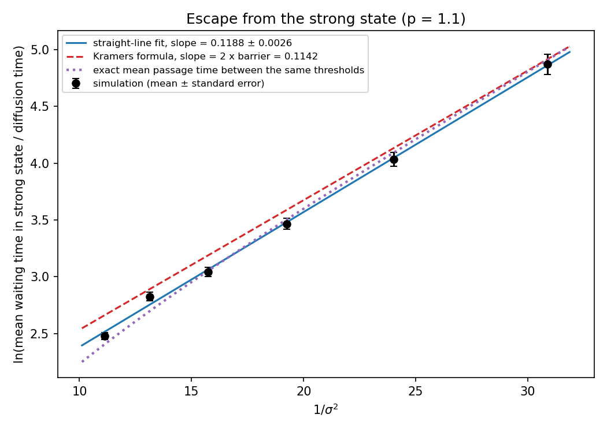
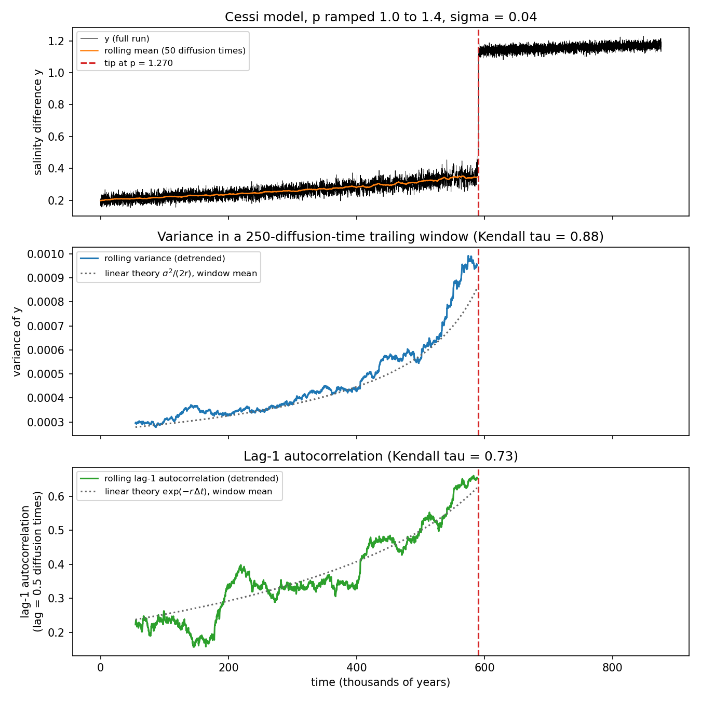

# 14. Tipping points in box models of the overturning circulation

Can the ocean's overturning circulation have two stable states under the same forcing? And what makes it switch from one to the other? The Atlantic overturning is one of the possible tipping elements of the climate system listed by Lenton et al. (2008). I used two classic box models, Stommel (1961) and Cessi (1994), to study this. I looked at slow changes in forcing, at random noise, and at whether a coming switch shows up in the fluctuations beforehand.

These are dimensionless conceptual models, not simulations of the real ocean. A line-by-line walk-through of every notebook is in [TUTORIAL.md](TUTORIAL.md), and a plain-language guide to the whole project is in [docs/tipping box models tutorial by OjashGiri.txt](<docs/tipping box models tutorial by OjashGiri.txt>).

## What I did

- `src/models.py`: the model equations as small shared functions, imported by all the notebooks.
- `notebooks/01_stommel_equilibria.ipynb`: I found the three equilibria of Stommel's two-box model with his graphical method, refined with `brentq`. I classified each one from the eigenvalues of the Jacobian, and ran forward Euler from 10 starting states to see which state each one ends in.
- `notebooks/02_stommel_hysteresis.ipynb`: I slowly raised the flow resistance lambda from 0.1 to 0.45 and back, starting each step from the previous end state. I located the fold where the temperature-driven state disappears, and compared it with Stommel's own estimate.
- `notebooks/03_cessi_landscape.ipynb`: I drew the equilibria and fold points of Cessi's one-equation model and its potential V(y), and ramped the freshwater forcing p up and down to show hysteresis.
- `notebooks/04_cessi_noise.ipynb`: I added white noise (Euler-Maruyama), compared the distribution of y with theory, counted flips between states, and tested Kramers' (1940) escape law at 6 noise levels. I also compared the waiting times with the exact mean first-passage time, which needs no weak-noise approximation.
- `notebooks/05_early_warning.ipynb`: I ramped p slowly past the fold with weak noise, and computed rolling variance and lag-1 autocorrelation of the detrended signal before the tip. I repeated the whole test for 100 runs with different random numbers, and for 100 control runs with no fold. This is the early-warning idea of Held and Kleinen (2004) and Dakos et al. (2008), applied to Cessi's model.
- `notebooks/06_antarctic_toy_model.ipynb` (exploratory): a two-variable toy model of an Antarctic ice-shelf margin that I wrote myself; it is not taken from a paper. Subsurface heat melts ice, meltwater freshens the surface, and freshening weakens vertical mixing. I tested whether this gives a threshold in the far-field ocean temperature. Abrupt warming of a cold ice-shelf cavity has been found in a regional ocean model (Hellmer et al. 2012), and the Filchner-Ronne cavity can sit in a warm or a cold state under the same forcing (Hazel and Stewart 2020). There the switch depends on which water mass fills the cavity; my toy model tests a different feedback.

## Main results



Stommel's model has two stable states for the same forcing: a temperature-driven node (f = -1.068) and a salinity-driven spiral (f = +0.219), separated by a saddle. 8 of my 10 starting states ended in the temperature-driven state (these are hand-picked starting points, not a measure of basin size). In Stommel's model salinity is restored towards a reservoir value, not forced by a fixed flux. Two states are only possible because salinity is restored more weakly than temperature: Stommel's condition R delta < 1 (here 1/3).


As lambda rises, the temperature-driven state meets the saddle at lambda = 0.3338 and both disappear, so the flow jumps to the salinity-driven state. Stommel (1961) estimated from his hand-drawn graph that this happens when lambda is "slightly greater than 1/4". Solving his equations exactly gives 0.3338: at lambda = 0.26 and 0.30 the temperature-driven state still exists. When lambda goes back down to 0.1, the flow stays salinity-driven (f = +0.2328), as Stommel already pointed out, because the salinity-driven state is stable over the whole range.



In Cessi's model, raising the freshwater forcing p tilts the potential landscape toward the weak-circulation state. At p = 1.35 the strong-circulation valley has gone.



With noise, the system flips at random between the two states. The log of the mean waiting time in the strong state falls on a straight line against 1/sigma^2, with fitted slope 0.1188 ± 0.0026 (standard error; 95% interval 0.112 to 0.126). That interval includes Kramers' prediction of 2 x barrier = 0.1142, so the waiting times scale as Kramers' law predicts. The waiting times themselves are 4-17% shorter than Kramers' formula. My timer starts partway up the barrier, and the noise is not weak (2 x barrier / sigma^2 is only 1.3 to 3.5). The exact mean first-passage time between the same two thresholds agrees with the simulations within 1.1 standard errors at the four weaker noise levels. At sigma = 0.276 and 0.30 the simulations are 14% and 8% longer (3.2 and 2.2 standard errors). A test with 20,000 walkers shows that the time step adds about 4% at sigma = 0.30 (11.52 with dt = 0.01, 11.14 with dt = 0.0025, exact 11.06).



Before the circulation tips, the variance and lag-1 autocorrelation of the fluctuations rise (Kendall tau 0.880 and 0.735 in the run shown) and roughly follow simple linear theory. The cause is that the recovery rate goes to zero at the fold. In 100 runs with different random numbers, Kendall tau was 0.775 to 0.912 for the variance and 0.664 to 0.855 for the autocorrelation (5-95% range). In 100 control runs at a fixed p = 1.1 it was -0.301 to 0.337 and -0.322 to 0.350. In the run shown, noise tipped the system at p = 1.2695, before the fold at p = 1.2962 (median over the 100 runs: p = 1.2769). The test is retrospective, as in Dakos et al. (2008): I cut each record using its known tip time.

In the toy Antarctic model the answer depends on choices I cannot pin down. With my baseline guesses, a mixing law of the form kappa0/(1 + F/F0) gives no threshold. The form kappa0 exp(-F/F0) gives a threshold, with folds at far-field temperatures of 3.149 and 3.505 deg C above freezing. The difference can be worked out by hand. Without melt cooling, a fold needs kappa0 tau_in > 8 for the first law and > 2.24 for the second, whatever the other parameters are, and the notebook confirms both numbers. With melt cooling, the first law needs vertical mixing to remove heat at least 13.66 times faster than the inflow supplies it. If the exponential law is set to halve the mixing at the same freshening as the rational law, it still has a threshold, but at 3.92 to 4.26 deg C. Details are in step 6 of [TUTORIAL.md](TUTORIAL.md).

## Checking my numbers against the papers

Stommel (1961), with R = 2, delta = 1/6, lambda = 1/5. Stommel read his values off a hand-drawn graph (his Table I).

| Equilibrium | f (mine) | f (Stommel) | Type (mine) | Type (Stommel) |
| :--- | ---: | ---: | :--- | :--- |
| temperature-driven | -1.0679 | -1.1 | stable node | stable node |
| middle | -0.3070 | -0.30 | saddle | saddle |
| salinity-driven | +0.2191 | +0.23 | stable spiral | stable spiral |

Stommel's estimate of the fold, "slightly greater than 1/4" (p. 229), also came from his graph. The exact value from his equations is 0.3338 (step 2).

Cessi (1994), with mu^2 = 6.2. Valleys and hill at p = 1.1, the forcing Cessi used. Each published value below comes from the source named next to it. I found no published value for the second fold, so that row is only checked against the quadratic formula.

| Quantity | Mine | Published | Source |
| :--- | ---: | ---: | :--- |
| strong-circulation valley | y = 0.2402 | 0.2402 | Yang et al. (2021), with Cessi's parameters |
| hill (unstable state) | y = 0.6911 | 0.6911 | Yang et al. (2021) |
| weak-circulation valley | y = 1.0687 | 1.0687 | Yang et al. (2021) |
| fold where the strong state ends | p = 1.2962 | about 1.3 | Cessi (1994), Fig. 4 |
| fold where the weak state ends | p = 0.9556 | none found | quadratic formula only |

## Limitations

- Both models are dimensionless boxes. They have no winds, no Earth rotation, no geography and no vertical structure, all of which shape the real overturning.
- The noise is white and additive. Real weather and freshwater variability has memory (red noise) and can depend on the state of the ocean.
- The forcing is a single number (lambda or p). In the real climate many forcings change at once.
- The temperature difference is held fixed in Cessi's model, so the atmosphere cannot respond to the ocean.
- Stommel's model mixes the boxes in proportion to |f|, so the flow direction does not affect the mixing. This is a strong simplification.
- The early-warning test uses one noise level, one ramp speed and one set of parameters, and it is retrospective: it uses the known tip time to cut each record. Across 100 random seeds the trend was always clear, but I did not vary the other choices.
- The toy Antarctic model has no cavity geometry, no sea ice, no winds and no ice dynamics. Its parameters are order-of-magnitude guesses, so it only shows what could happen, not what does.
- The numbers are in model units. Converting to years (one diffusion time of about 219 years in Cessi's model) is only a rough guide.

## How to run

Create the environment from the repository's `environment.yml` (it includes numpy, scipy and matplotlib), then start JupyterLab:

```bash
conda env create -f environment.yml
conda activate ocean-portfolio
jupyter lab
```

In JupyterLab, open the notebooks in `project_14_tipping_box_models/notebooks/` in order (`01_stommel_equilibria.ipynb` to `06_antarctic_toy_model.ipynb`) and run each one from top to bottom. The notebooks import the model equations from `../src/models.py` and save figures to `../figures/`, so keep the folder structure as it is. The notebooks are saved with the standard Python 3 kernel; if Jupyter asks for a kernel, choose the one for the `ocean-portfolio` environment.

Each notebook prints its key numbers, shows its figures, and saves them to `figures/`. On my laptop notebook 05 took about 40 seconds and the others under 20 seconds each. The notebooks with noise use fixed random seeds, so the numbers repeat exactly.

## References

- Cessi, P. (1994). A simple box model of stochastically forced thermohaline flow. Journal of Physical Oceanography, 24(9), 1911–1920. https://doi.org/10.1175/1520-0485(1994)024<1911:ASBMOS>2.0.CO;2
- Dakos, V., Scheffer, M., van Nes, E. H., Brovkin, V., Petoukhov, V., & Held, H. (2008). Slowing down as an early warning signal for abrupt climate change. Proceedings of the National Academy of Sciences, 105(38), 14308–14312. https://doi.org/10.1073/pnas.0802430105
- Ditlevsen, P. D., & Johnsen, S. J. (2010). Tipping points: Early warning and wishful thinking. Geophysical Research Letters, 37(19). https://doi.org/10.1029/2010GL044486
- Hazel, J. E., & Stewart, A. L. (2020). Bistability of the Filchner-Ronne Ice Shelf cavity circulation and basal melt. Journal of Geophysical Research: Oceans, 125(4), e2019JC015848. https://doi.org/10.1029/2019JC015848
- Held, H., & Kleinen, T. (2004). Detection of climate system bifurcations by degenerate fingerprinting. Geophysical Research Letters, 31(23). https://doi.org/10.1029/2004GL020972
- Hellmer, H. H., Kauker, F., Timmermann, R., Determann, J., & Rae, J. (2012). Twenty-first-century warming of a large Antarctic ice-shelf cavity by a redirected coastal current. Nature, 485(7397), 225–228. https://doi.org/10.1038/nature11064
- Kramers, H. A. (1940). Brownian motion in a field of force and the diffusion model of chemical reactions. Physica, 7(4), 284–304. https://doi.org/10.1016/S0031-8914(40)90098-2
- Lenton, T. M., Held, H., Kriegler, E., Hall, J. W., Lucht, W., Rahmstorf, S., & Schellnhuber, H. J. (2008). Tipping elements in the Earth's climate system. Proceedings of the National Academy of Sciences, 105(6), 1786–1793. https://doi.org/10.1073/pnas.0705414105
- Stommel, H. (1961). Thermohaline convection with two stable regimes of flow. Tellus, 13(2), 224–230. https://doi.org/10.1111/j.2153-3490.1961.tb00079.x
- Yang, F., Sun, X., & Duan, J. (2021). On the abrupt change of the maximum likelihood state in a simplified stochastic thermohaline circulation system. Chaos, 31(2), 021103. https://doi.org/10.1063/5.0037083
