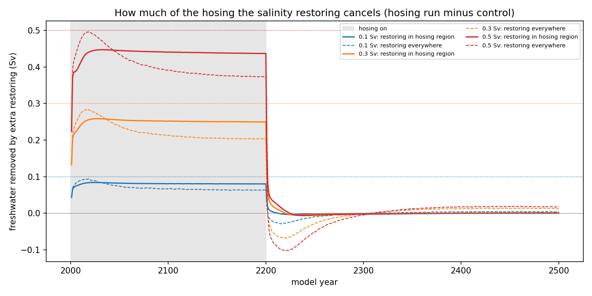
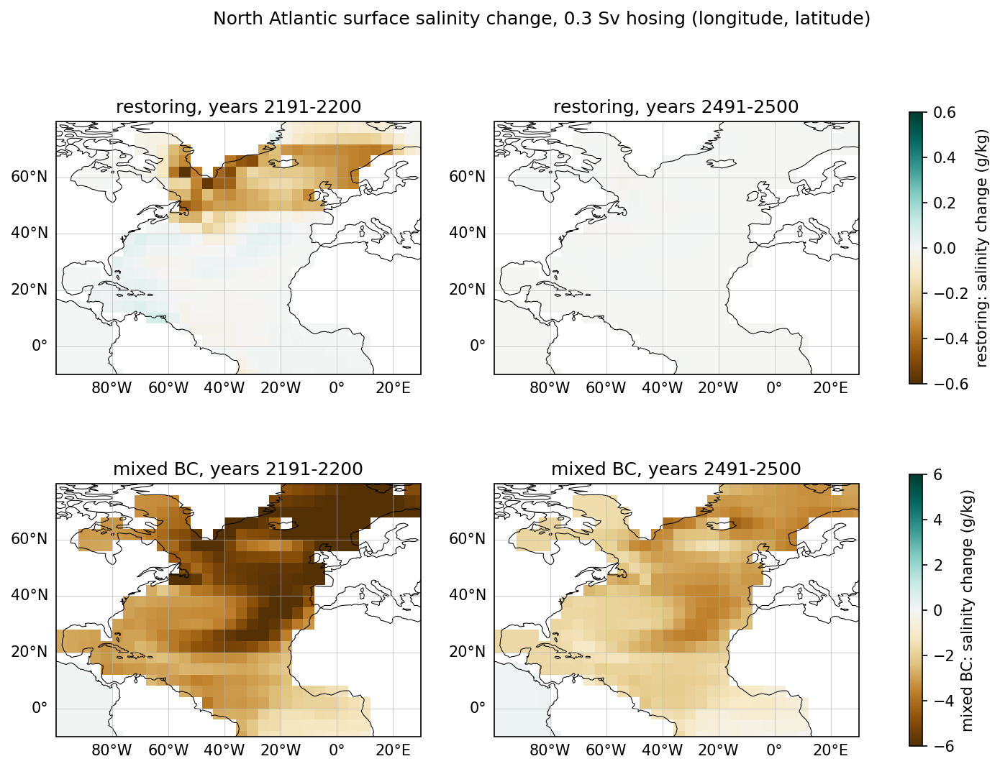
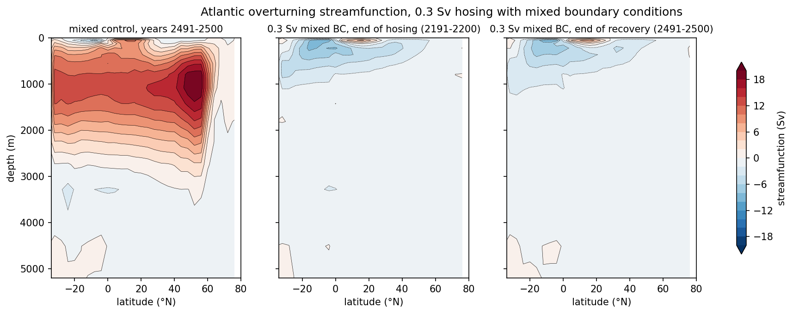
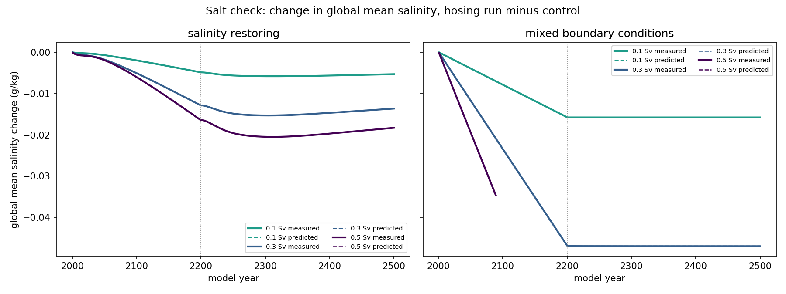

# 15. Freshwater hosing in MITgcm: does the AMOC have two stable states?

How does the Atlantic overturning circulation (AMOC) in a global ocean model respond to extra freshwater in the North Atlantic, and does the surface boundary condition for salinity change the answer? I tested this in MITgcm with 0.1, 0.3 and 0.5 Sv of "hosing", once with surface salinity restored toward observations and once with mixed boundary conditions. This project follows on from my box-model project (14), where Stommel's model showed two stable states.

A detailed, step-by-step account of every command and choice is in [TUTORIAL.md](TUTORIAL.md).

## Model setup

- MITgcm, release `checkpoint69q` (commit 853761d8), experiment `tutorial_global_oce_latlon`: a global ocean on a 4° x 4° grid (90 x 40 points, 80°S to 80°N) with 15 levels, 50 m thick at the surface and 690 m at the bottom.
- Forcing: monthly wind stress, net heat flux and freshwater flux (EmPmR), repeated every year. Surface temperature is restored toward climatology over 60 days, and surface salinity over 180 days (restoring runs only).
- The model uses a 360-day year (12 months of 30 days). All conversions to "per year" in this project, such as metres of water per year, use 360 days.
- Accelerated time stepping: tracers (temperature and salinity) step 1 day at a time, momentum 30 minutes. The deep ocean reaches equilibrium much faster this way, and the equilibrium itself is unaffected. But time-dependent behaviour is distorted, so I take the equilibrium states literally and not the time scales of change, such as how many years the AMOC takes to weaken or recover.
- Spin-up: 2000 model years with the tutorial's forcing and restoring. The final AMOC was 19.80 Sv (mean of the last 100 years), drifting by +0.042 Sv per century.
- The AMOC index is the maximum of the Atlantic overturning streamfunction between 20°N and 60°N and below 500 m. It is the resolved (Eulerian) overturning only. The eddy-induced part from the GM scheme is not included, because its diagnostic is not filled in this GM setup.
- All runs used one core each, on an Apple M1 laptop. A single run did about 4.7 s per model year, and four at once about 10 s each.

## What I did

- `notebooks/01_build_and_verify.ipynb`: built MITgcm and checked that the tutorial's short test reproduces the official reference output, then timed the model.
- `notebooks/02_spinup.ipynb`: ran and analysed the 2000-year spin-up, built an Atlantic basin mask, computed the overturning streamfunction and the AMOC index, and checked the drift and the salt budget.
- `notebooks/03_make_hosing_forcing.ipynb`: made freshwater-flux files that add exactly 0.1, 0.3 and 0.5 Sv over the subpolar North Atlantic (50-70°N, 60°W-20°E).
- `notebooks/04_hosing_with_restoring.ipynb`: hosing for 200 years, then 300 years without it, with salinity restoring, and how much of the hosing the restoring cancels.
- `notebooks/05_mixed_boundary_conditions.ipynb`: replaced salinity restoring with the equivalent fixed freshwater flux (mixed boundary conditions) and ran a 500-year control.
- `notebooks/06_hosing_with_mixed_bc.ipynb`: the same hosing experiments with mixed boundary conditions, plus the diagnosis of a numerical failure, an integrity check of all runs, and a sensitivity test.
- `notebooks/07_compare_and_check.ipynb`: summary of all runs, a salt-budget check of every hosing run, and the connection to Stommel's model.

## Main results


With salinity restoring (left), the AMOC weakened by 11-41% during hosing and recovered fully in every run once the hosing stopped. With mixed boundary conditions (right), every run collapsed to an AMOC index of about zero and stayed there for the 300 years after the hosing stopped, even with 0.1 Sv.



Within a few years, the salinity restoring removed 80-87% of the added freshwater in the hosing region. The surface had to stay fresher than observed for the restoring to push back, and that leftover freshening is what weakened the AMOC. But the push back grows as the surface gets fresher, so the AMOC could not collapse.



For 0.3 Sv, the hosing region was 0.30 g/kg fresher at the end of hosing with restoring, and back to normal 300 years later. With mixed boundary conditions it was 5.73 g/kg fresher, and still 2.79 g/kg fresher 300 years after the hosing stopped. Note the different colour scales.



Under mixed boundary conditions the deep overturning cell (about 20 Sv in the control) disappeared and did not come back. Only a shallow cell near the tropics remained.



The change in global mean salinity in every hosing run matches what the added freshwater and the restoring predict, to within 0.1%. The dashed predictions are hidden under the measured lines.

## Checks

- Reference run: my build reproduces the tutorial's reference output. The strict (IEEE) build agrees to at least 11.3 significant digits and the optimized build to at least 10.0, over 164 monitored quantities. The global mean vertical velocity is left out, because it is rounding noise around zero.
- Hosing totals: each forcing file, read back from disk and integrated over the model's ocean area, adds 0.10000000, 0.30000000 and 0.50000000 Sv in every month. A one-year test confirmed that the model received 0.5000 Sv of extra freshwater, all inside the hosing region.
- Salt check:
  - Measured and predicted changes in global mean salinity agree to within 0.1% in all hosing runs, once the model's conversion of freshwater mass to volume (1000/1035) is included.
  - The total salt follows the net freshwater input plus the salt added by restoring.
  - A separate prediction for the two controls agreed to within 0.3%.
- Integrity check: I scanned every run for NaN, for its temperature and salinity range, and for temperatures below the freezing point. All runs passed, except the 0.5 Sv run with mixed boundary conditions (see limitations).

## Limitations

- Coarse resolution: 4° grid cells and 15 levels. Boundary currents, overflows and eddies are not resolved.
- No atmosphere and no sea ice. Temperature restoring stands in for the atmosphere, and salinity is either restored (artificial) or fixed. The real atmosphere and sea ice would respond to a weaker AMOC.
- Idealized hosing. The extra freshwater is spread evenly over 50-70°N and not taken out anywhere else, so global sea level rises (by several metres in the 0.5 Sv runs).
- Distorted transient time scales, because of the accelerated time stepping. Only equilibrium states should be taken literally.
- A closed wall at 80°N. There is no Arctic Ocean and no freshwater outflow from the Nordic Seas into it. Hosing water and the fixed freshening from the mixed boundary condition can only leave southward, so the fresh surface layer in the Nordic Seas was probably much stronger than it would be in the real ocean.
- The switch to mixed boundary conditions is itself a shock. Without any hosing, the AMOC dipped from 19.78 to 16.51 Sv before settling at 19.74 Sv. The mixed-BC hosing started at the same time as this switch.
- Numerical failure. The 0.5 Sv run with mixed boundary conditions blew up in model year 2090, after its AMOC had already collapsed. It still printed "ended normally", because the model's yearly bounds check let NaN pass.
  - I traced the failure to one water column next to the 80°N wall, under an extremely fresh surface layer, with the tutorial's centred advection scheme.
  - Rerun from a clean state with a flux-limited advection scheme, it stayed stable to year 2200 and stayed collapsed.
  - I report that run only up to 2089. Future runs check for instability every model month, with a check that also stops on NaN.
- One run per case. Because the forcing repeats exactly every year, there is almost no natural variability, so single runs are enough to see the response, but the model's own variability is much smaller than the real ocean's.
- The AMOC index excludes the eddy-induced (GM) transport.

## How to reproduce

The model source code and all runs (about 4 GB) live outside the repository. Only scripts, changed parameter files, small forcing files, notebooks, figures and small processed results are in this folder.

1. Requirements: macOS on Apple silicon with Homebrew's `gfortran`, `make` and netCDF, and the repository's conda environment (`environment.yml`) plus MITgcmutils.
2. Get MITgcm and install its Python reader:

   ```bash
   git clone --depth 1 --branch checkpoint69q https://github.com/MITgcm/MITgcm.git ~/models/MITgcm
   python -m pip install --no-deps ~/models/MITgcm/utils/python/MITgcmutils
   ```

3. Build (from inside `project_15_mitgcm_freshwater_hosing/`):

   ```bash
   T=~/models/MITgcm/verification/tutorial_global_oce_latlon
   bash scripts/build.sh $T/code ~/mitgcm_runs/hosing/build_reference_ieee ieee     # step 1 check
   bash scripts/build.sh $T/code ~/mitgcm_runs/hosing/build_spinup_fast fast experiments/spinup/code
   bash scripts/build.sh $T/code ~/mitgcm_runs/hosing/build_safe_fast fast experiments/safety_code   # for new runs
   ```

4. Run. Each command is documented in TUTORIAL.md.

   ```bash
   bash scripts/run_experiment.sh ~/mitgcm_runs/hosing/build_reference_ieee $T/input ~/mitgcm_runs/hosing/reference_test_ieee
   bash scripts/run_experiment.sh ~/mitgcm_runs/hosing/build_spinup_fast $T/input ~/mitgcm_runs/hosing/spinup experiments/spinup/input
   bash scripts/run_hosing_set.sh restore experiments/hosing_forcing ~/mitgcm_runs/hosing/spinup
   bash scripts/run_experiment.sh ~/mitgcm_runs/hosing/build_spinup_fast $T/input ~/mitgcm_runs/hosing/mixed_control \
       "experiments/spinup/input experiments/mixed_control/input experiments/mixed_forcing/emp_mixed.bin" ~/mitgcm_runs/hosing/spinup
   bash scripts/run_hosing_set.sh mixed experiments/mixed_forcing ~/mitgcm_runs/hosing/spinup experiments/mixed_forcing/emp_mixed.bin skip_control
   ```

   The spin-up takes about 2.6 hours. Each hosing set takes about 1.2-1.5 hours. Notebooks 03 and 05 write the forcing files that the hosing runs need. So run notebook 03 before the restoring set, and the cells of notebook 05 up to "Part B" before the mixed control. Run the whole of notebook 05 once the mixed control has finished. Steps 1 and 2 also used short timing and test runs, and step 6 used diagnostic and sensitivity runs. Their changed files are in `experiments/` and their commands are in TUTORIAL.md.

5. Open JupyterLab and run the notebooks in `notebooks/` in order, 01 to 07. They read the runs from `~/mitgcm_runs/hosing/` and write figures to `figures/` and small results to `data/`.

## References

- Stommel, H. (1961). Thermohaline convection with two stable regimes of flow. Tellus, 13, 224-230.
- Bryan, F. (1986). High-latitude salinity effects and interhemispheric thermohaline circulations. Nature, 323, 301-304.
- Rahmstorf, S., et al. (2005). Thermohaline circulation hysteresis: A model intercomparison. Geophysical Research Letters, 32, L23605.
- Lenton, T. M., et al. (2008). Tipping elements in the Earth's climate system. Proceedings of the National Academy of Sciences, 105, 1786-1793.
- MITgcm documentation: https://mitgcm.readthedocs.io
