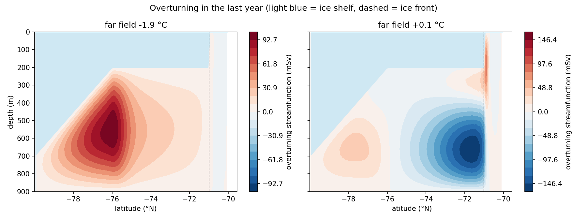
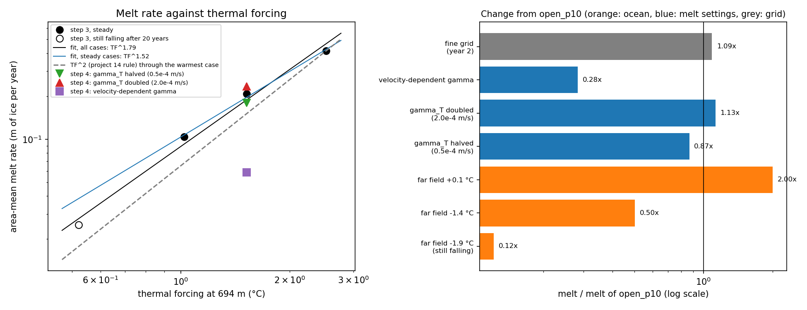
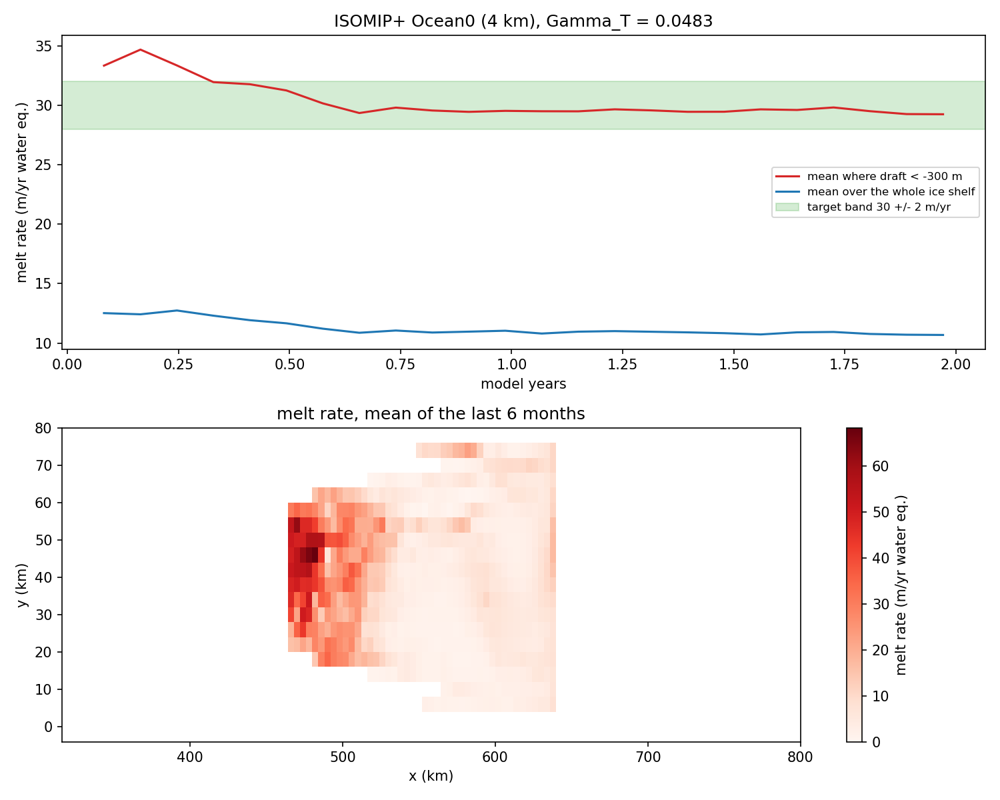

# 16. Melting under an ice shelf in MITgcm: how does melt depend on ocean temperature?

How fast does the ocean melt a floating ice shelf from below, and how does that melt rate depend on the temperature of the ocean outside the cavity, on the uncertain settings of the melt formula, and on the grid? I tested this with MITgcm's `isomip` ice-shelf cavity experiment, and then set up the ISOMIP+ Ocean0 test case from its published specification. The project follows on from project 14, where a toy model assumed that melt grows with the square of the ocean temperature above freezing.

A detailed, step-by-step account of every command and choice is in [TUTORIAL.md](TUTORIAL.md). A plain-language guide to the whole project, written for someone repeating it alone, is in [docs/icemodel tutorial by OjashGiri.txt](docs/icemodel%20tutorial%20by%20OjashGiri.txt).

## Model setup

- MITgcm, release `checkpoint69q` (commit 853761d8), experiment `isomip` with the ice-shelf package `pkg/shelfice`. The MITgcm source is never changed; the experiment's files are copied, and every changed file is kept in `experiments/`.
- Domain (steps 1-6): 80°S to 70°S over 15° of longitude, 50 x 100 points (0.3° x 0.1°), 30 levels of 30 m over a flat 900 m seafloor. The ice shelf (ISOMIP Experiment 1) has its base at about 700 m at the southern wall, rising to 200 m at 76°S and flat to the north. The ice shape is fixed in time.
- The original box is sealed and has no forcing, so from step 3 on I removed the ice north of 71°S and restored temperature and salinity in that open-ocean zone (`pkg/rbcs`, 1 day).
- Melt: from step 2 on, the three-equation model (Holland and Jenkins 1999) with constant transfer coefficients (gamma_T = 1e-4 m/s, gamma_S = 5.05e-3 gamma_T), averaged over a boundary layer one cell thick (Losch 2008). Step 4 also tests velocity-dependent coefficients.
- The setup has no calendar. Melt rates are in metres of ice per 365-day year (ice density 917 kg/m^3). ISOMIP+ results (step 7) are in metres of water per 365.2422-day year, as its specification asks.
- Time step 1800 s. Each run used one core of an Apple M1 laptop, about 8 minutes per model year (one run alone) to 17 minutes (four at once).
- Safety rules from project 15: the bounds check stops on NaN, the monitor runs every 30 model days, and a run with NaN in its own output lines is treated as failed.

## What I did

- `notebooks/01_build_and_verify.ipynb`: built MITgcm, checked the `isomip` test against the official reference output, read the melt settings and their defaults, and timed the model.
- `notebooks/02_baseline_cavity.ipynb`: a 5-year baseline with the three-equation melt model: geometry, melt map, temperature and salinity sections, circulation, and the ice pump.
- `notebooks/03_melt_vs_ocean_temperature.ipynb`: made the open-ocean restoring zone, ran far fields of -1.9, -1.4, -0.9 and +0.1 °C, fitted a power law of melt against thermal forcing, and found out where the extra melt happens. It also documents a first design that failed.
- `notebooks/04_melt_parameter_sensitivity.ipynb`: halved and doubled the heat transfer coefficient, and switched to velocity-dependent coefficients.
- `notebooks/05_checks_and_summary.ipynb`: a salt-budget check, a summary table and figure, and the comparison with the project 14 melt rule.
- `notebooks/06_resolution_test.ipynb` (optional step): the -0.9 °C case on a grid with half the spacing.
- `notebooks/07_isomip_plus_ocean0.ipynb` (optional step): ISOMIP+ Ocean0 at 4 km resolution, calibration of Gamma_T to the target melt rate, and a list of every deviation from the specification.

## Main results


Thermal forcing (TF) is the far-field temperature minus the freezing point at the deepest ice base (694 m). The area-mean melt rate grows faster than linearly with it: melt = 0.104 x TF^1.52 for the three cases that reached a steady state, and TF^1.79 if the coldest case is included. That case was still falling by 3.7% per year after 20 years (open circle), so its value is an upper limit. The exponent between neighbouring cases falls from 2.11 to 1.37 as the ocean warms. Meltwater drives an exchange flow across the ice front that brings in more heat: it grew from 11 to 268 mSv, roughly as TF^2.



The circulation changes as the far field warms. With -1.9 °C there is one ice-pump cell: water sinks toward the deep grounding line and returns along the ice base. With +0.1 °C a new cell of the opposite sign fills the cavity north of 76°S. Because my restored water always has salinity 34.4, warming it makes it lighter than the cold water in the deep cavity (by 0.08 kg/m^3 at +0.1 °C). So it stays near the ice front, and the deep cavity stays at about -2.0 °C. The row of ice behind the ice front produces about 30% of all the melt, while melt under the deep ice hardly changes with warming (exponent -0.04).



Compared with the -0.9 °C case:
- warming the far field by 1 °C doubles the melt;
- halving or doubling gamma_T changes it by only -13% and +13%, because the water next to the ice adjusts and the heat supply limits the melt;
- velocity-dependent transfer coefficients cut it to 28%, because the currents next to the ice are only about 1 mm/s;
- halving the grid spacing adds 9%, nearly all of it at the ice front.



In ISOMIP+ Ocean0 at 4 km resolution, Gamma_T = 0.0483 gives a mean melt of 29.53 m/yr where the ice draft is deeper than 300 m, over the last 6 months of a 2-year run. That is inside the 30 +/- 2 m/yr target, and the run is steady. The whole-shelf mean is 10.79 m/yr. My Gamma_T is 2.2 times the paper's suggested first guess (0.022) and 0.44 times the value the POP2x model needed (about 0.11). Here the warm water is also salty and dense, so the strongest melting (up to 68 m/yr) is at the deep grounding line, the opposite of my step 3 runs.

## Checks

- Reference run: my strict (IEEE) build agrees with the official `isomip` output to at least 9.6 significant digits, and the optimized build to at least 7.5, over 50 monitored quantities at monitor times 10-20. The first steps and the mean sea level are pure rounding noise and are left out.
- Salt budget: in the sealed baseline, the change in volume-mean salinity over 1800 days agrees with the salt removed by melting to within 0.08%. This requires using the salinity right at the ice base, which I solved from the model's own salt balance. With the salinity of the top cell instead, the error would be 3.7%.
- Restoring zone: in every step 3 run its temperature sat on the target to 0.001 °C, and the melt there is exactly zero, because there is no ice above it.
- Integrity: every run ended normally, with no NaN in the logs and no non-finite values in any output file.
- Steadiness: I test each case by the change in its 12-month mean melt (less than 2% per year counts as steady). The -1.4 °C and +0.1 °C cases pass clearly. The -0.9 °C case and its step 4 variants change by 2.0-3.0% per year, so I compare them at the same time (year 10). The -1.9 °C case does not pass after 20 years.

## Limitations

- Idealized geometry: a box with a flat seafloor and an ice shelf that changes only from south to north. ISOMIP+ is more realistic but still idealized.
- Fixed ice shape: melting never thins the ice, the cavity never changes, and the grounding line never moves.
- Coarse resolution: 6-11 km cells and 30 m layers in steps 1-6, and 4 km instead of the specified 2 km in step 7. The step 6 test shows that the melt at the ice front is not converged (20% more on the finer grid).
- No tides, no sea ice, no atmosphere. The only forcing is restoring in a narrow open-ocean zone. Tides would stir the boundary layer, which matters most for velocity-dependent coefficients (step 4).
- Uncertain transfer coefficients. Their size and form change the melt by up to a factor of 3.5, and the velocity-dependent result partly depends on a 1 mm/s minimum speed in the code (25.6% of the ice sat at it).
- Uniform far-field salinity in step 3. Warming the far field also makes the water lighter, unlike real warm Circumpolar Deep Water, so the warm water does not reach the deep grounding zone.
- Run length: the coldest step 3 case is not steady after 20 years, and the resolution test covers only the first 2 years.
- A failed first design: restoring under the ice (`experiments/rbcs_*`) melted the ice above the restoring zone and never reached the deep cavity. I kept these runs only as a documented lesson (notebook 03, Part B1).
- ISOMIP+ deviations: there are 13, listed at the end of notebook 07. They include the resolution, a changed copy of the melt code, the bedrock taken from the data file instead of the analytic formula, `hFacMin = 0.2` and a 300 s step for stability, and a virtual salt flux.

## How to reproduce

The model source code (0.5 GB) and all runs (3.4 GB) live outside the repository. Only scripts, changed parameter files, small input files, notebooks, figures and small processed results are in this folder.

1. Requirements: macOS on Apple silicon with Homebrew's `gfortran`, `make` and netCDF; the repository's conda environment plus MITgcmutils. For step 7, the ISOMIP+ geometry file `Ocean1_input_geom_v1.01.nc` (doi:10.5880/PIK.2016.002) in `~/mitgcm_runs/isomip/isomip_plus_data/`.
2. Get MITgcm, install its Python reader and copy the experiment:

   ```bash
   git clone --depth 1 --branch checkpoint69q https://github.com/MITgcm/MITgcm.git ~/models/MITgcm
   python -m pip install --no-deps ~/models/MITgcm/utils/python/MITgcmutils
   mkdir -p ~/mitgcm_runs/isomip/source_copy
   cp -R ~/models/MITgcm/verification/isomip/{code,input,results} ~/mitgcm_runs/isomip/source_copy/
   ```

3. Build (from inside `project_16_mitgcm_ice_shelf_cavity/`):

   ```bash
   C=~/mitgcm_runs/isomip/source_copy/code; B=~/mitgcm_runs/isomip
   bash scripts/build.sh $C $B/build_reference_ieee ieee                              # step 1 check
   bash scripts/build.sh $C $B/build_safe_fast fast experiments/safety_code          # step 2
   bash scripts/build.sh $C $B/build_rbcs_fast fast experiments/rbcs_code            # steps 3-4
   bash scripts/build.sh $C $B/build_fine_fast fast experiments/fine_code            # step 6
   bash scripts/build.sh $C $B/build_isoplus_fast fast experiments/isomip_plus_code  # step 7
   ```

4. Run. Notebooks 03, 06 and 07 write the input files the runs need in their "Part A", so run those parts first. Each command is documented in TUTORIAL.md.

   ```bash
   I=~/mitgcm_runs/isomip/source_copy/input
   bash scripts/run_experiment.sh $B/build_reference_ieee $I $B/reference_test_ieee
   bash scripts/run_experiment.sh $B/build_safe_fast $I $B/baseline experiments/baseline/input    # 43 min
   bash scripts/run_open_cases.sh $B/inputs_rbcs base p05 p10 p20                                 # 2.9 h
   bash scripts/run_extension.sh $B/inputs_rbcs base_ext                                          # 2.4 h
   bash scripts/run_extension.sh $B/inputs_rbcs p05_ext
   bash scripts/run_open_cases.sh $B/inputs_rbcs g05 g20 frict                                    # 2.9 h
   bash scripts/run_fine_case.sh $B/inputs_fine fine_p10                                          # 2.2 h
   bash scripts/run_isoplus_cases.sh isoplus_g025 isoplus_g050 isoplus_g100 isoplus_g200         # 1.1 h
   bash scripts/run_isoplus_cases.sh isoplus_final                                                # 1.5 h
   ```

   The failed first design of step 3 can be rerun with `bash scripts/run_rbcs_cases.sh`.

5. Open JupyterLab and run the notebooks in `notebooks/` in order, 01 to 07. They read the runs from `~/mitgcm_runs/isomip/` and write figures to `figures/` and small results to `data/`.

## References

- Holland, D. M., and A. Jenkins (1999). Modeling thermodynamic ice-ocean interactions at the base of an ice shelf. Journal of Physical Oceanography, 29, 1787-1800.
- Losch, M. (2008). Modeling ice shelf cavities in a z coordinate ocean general circulation model. Journal of Geophysical Research, 113, C08043.
- Holland, P. R., A. Jenkins and D. M. Holland (2008). The response of ice shelf basal melting to variations in ocean temperature. Journal of Climate, 21, 2558-2572.
- Asay-Davis, X. S., et al. (2016). Experimental design for three interrelated marine ice sheet and ocean model intercomparison projects: MISMIP v. 3 (MISMIP+), ISOMIP v. 2 (ISOMIP+) and MISOMIP v. 1 (MISOMIP1). Geoscientific Model Development, 9, 2471-2497.
- Cornford, S., and X. Asay-Davis (2016). Ice-shelf surface, basal and bedrock topography data for the second Ice Shelf-Ocean Model Intercomparison Project (ISOMIP+). GFZ Data Services, doi:10.5880/PIK.2016.002.
- MITgcm documentation: https://mitgcm.readthedocs.io
