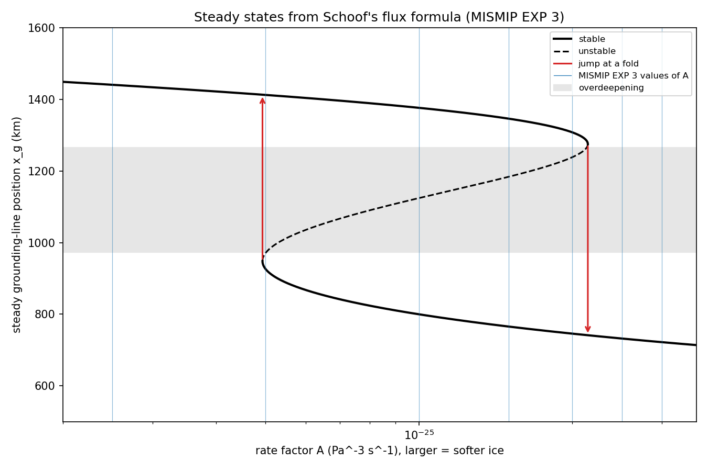
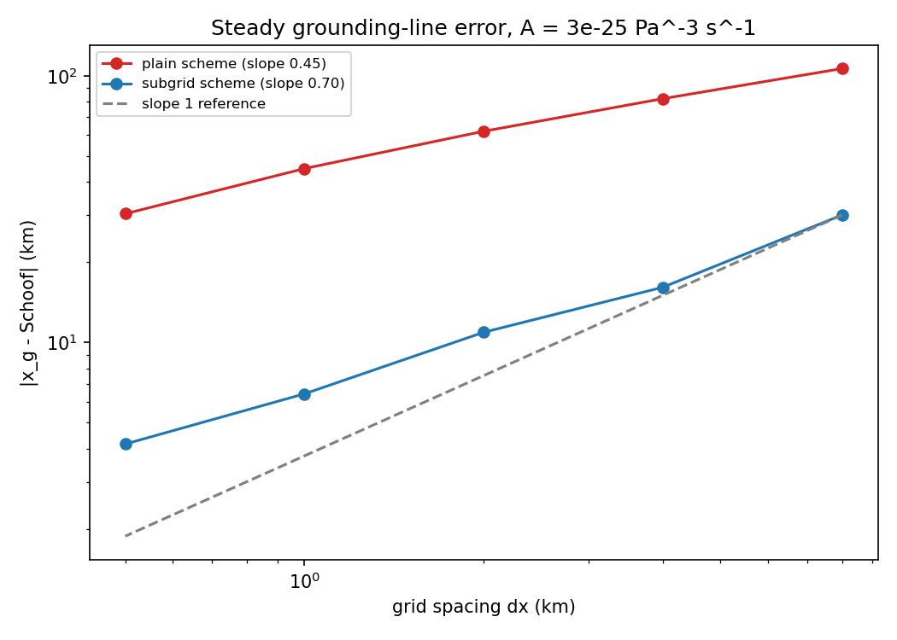
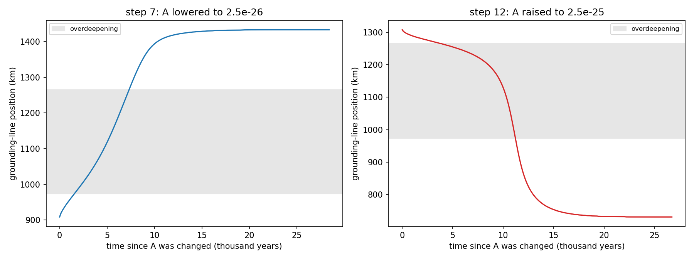
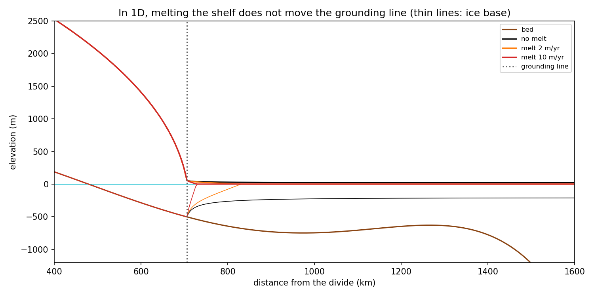

# 17. A marine ice-sheet flowline model: instability, hysteresis and grid resolution

Can a marine ice sheet, an ice sheet resting on a bed below sea level, have unstable grounding-line positions and jump between steady states with hysteresis? And how much does the answer from a numerical model depend on its grid resolution? I wrote my own 1D flowline model in Python to reproduce the marine ice-sheet instability of Schoof (2007) on the MISMIP experiment 3 bed (Pattyn et al. 2012), and measured how the computed grounding line depends on the grid.

A step-by-step account of every equation, code block and result is in [TUTORIAL.md](TUTORIAL.md). A plain-language guide to the whole project, written for someone repeating it alone, is in [docs/ice sheet flowline tutorial by OjashGiri.txt](docs/ice%20sheet%20flowline%20tutorial%20by%20OjashGiri.txt).

## Model

- Geometry and parameters: MISMIP experiment 3 (Pattyn et al. 2012), checked against the paper and against Schoof (2007). A polynomial bed that is above sea level near the ice divide, crosses sea level at 478.7 km, and gets deeper inland between 973.7 and 1265.7 km (the overdeepening). Ice density 900 kg/m^3, seawater 1000 kg/m^3, n = 3, m = 1/3, C = 7.624e6 Pa m^(-1/3) s^(1/3), snowfall 0.3 m/yr, and A from 3e-25 down to 2.5e-26 Pa^-3 s^-1 and back. The code works in metres and years (one year = 31 556 926 s), and the calving front is fixed at 1600 km.
- Velocity: the shallow-shelf approximation. At every point the stretching stress, the basal friction (only under grounded ice, C |u|^(m-1) u) and the driving stress from the surface slope balance, with u = 0 at the divide and the ice-cliff push minus the water push at the calving front. The viscosity follows Glen's flow law, so the equation is nonlinear; I solve it by Picard iteration, with a tridiagonal solve (`scipy.linalg.solve_banded`) in each iteration, and small floors on the strain rate and speed that keep the viscosity and friction finite.
- Thickness: mass conservation, dH/dt = a - d(uH)/dx, with upwind fluxes and an explicit time step limited so that no ice moves more than half a cell per step.
- Grid: staggered, with thickness at cell centres and velocity at cell edges.
- Grounding line: ice is grounded where it is thicker than the flotation thickness, -(rho_w/rho_i) b. In the plain scheme each edge is either grounded or floating. In the sub-grid scheme (after Gladstone et al. 2010 and Leguy et al. 2014) the grounding line is placed between two cell centres where the thickness above flotation crosses zero, and the friction in that one cell is multiplied by its grounded fraction.

All model functions are in `notebooks/flowline.py`, as small plain functions.

## What I did

- `notebooks/01_schoof_steady_states.ipynb`: the bed, Schoof's grounding-line flux formula, steady states as crossings of snowfall and outflow, their stability, and the hysteresis loop over the MISMIP range of A.
- `notebooks/02_velocity_solver_and_shelf_test.ipynb`: the shallow-shelf velocity solver tested against exact ice-shelf solutions.
- `notebooks/03_time_dependent_model_and_resolution.ipynb`: mass conservation and time stepping; steady states at grid spacings from 8 to 0.5 km with the plain and the sub-grid scheme, compared with Schoof's prediction, and an advance-against-retreat test.
- `notebooks/04_hysteresis_experiment.ipynb`: the 13 MISMIP values of A, down and back up, each run to steady state with the sub-grid scheme at 1 km, and the jumps across the overdeepening in time.
- `notebooks/05_checks_and_summary.ipynb`: the mass check, a summary of all runs, and two tests showing that in 1D the ice shelf cannot hold the grounding line back.

## Main results



Schoof's formula gives two stable steady grounding-line positions for 4.930e-26 < A < 2.145e-25 Pa^-3 s^-1, with an unstable branch between them across the overdeepening. When A is lowered past 4.93e-26 the grounding line must jump forward by 464.6 km; when it is raised past 2.145e-25 it must jump back by 533.7 km.



For A = 3e-25 Pa^-3 s^-1, Schoof's steady grounding line is at 721.90 km. On a plain fixed grid my model stops 106.45 km short at 8 km spacing and still 30.40 km short at 0.5 km (the error shrinks only like dx^0.45). The sub-grid scheme is 30.06 km short at 8 km and 4.16 km at 0.5 km (like dx^0.70). On coarse grids the steady position also depends on whether the grounding line advanced or retreated into place: at 2 km with the sub-grid scheme, 710.98 km after advancing and 725.70 km after retreating.


Stepping A down and back up through the MISMIP values, my model (sub-grid scheme, 1 km) stays on Schoof's stable branches, within 7.3 km of his positions except next to the lower fold (17.6 km). It jumps forward across the overdeepening only when A is lowered to 2.5e-26, and back only when A is raised to 2.5e-25, so for four values of A it has two different steady states depending on its history.



Crossing the overdeepening takes thousands of years: 5800 years for the advance and 7500 years for the retreat. The retreat speeds up as it goes, reaching 167 m/yr near the landward end of the overdeepening.



In 1D the floating shelf cannot hold the grounding line back: melting it from below at 10 m/yr thins it from 258 m to 8.5 m on average without moving the grounding line. Halving the shelf thickness changes the speed of the grounded ice by less than 1e-9 m/yr.

## Checks

- Velocity solver: on a floating shelf of uniform thickness the error is 5.6e-8 of the front speed at every grid spacing, and it equals the predicted effect of the strain-rate floor. On a shelf that thins linearly the error falls with convergence rate 2.001, as centred differences should.
- Schoof's steady states: the time-dependent model approaches them as the grid is refined (step 3), and follows both stable branches of the hysteresis loop (step 4).
- Mass: the change in ice volume equals the total snowfall minus the ice that crossed the calving front (and minus the ice melted, in the melting runs) to a relative difference of 1.87e-14. In steady state the snowfall and calving rates differ by 0.033%.
- Units: Schoof's flux computed in seconds and in years agrees to a relative difference of 1.1e-16, and with my conversion of C a basal stress of 80 kPa gives 36.46 m/yr of sliding, against "about 35 m/yr" in Schoof (2007).

## Limitations

- 1D only: no sideways flow, no side walls, and therefore no buttressing. In this model the ice shelf has no effect on the grounding line at all.
- A simple power-law sliding law everywhere under grounded ice, with fixed C. Other sliding laws change the grounding-line flux and its exponent.
- No ocean melting in the main experiments. The melting in step 5 is only a test, at fixed rates, with no ocean model.
- A fixed calving front at 1600 km.
- A simple sub-grid scheme: only the friction in the grounding-line cell is scaled. Even at 0.5 km it is 4.16 km short of Schoof's position, and on coarse grids its result depends on the history.
- The time stepping is explicit, so the time step shrinks with the grid spacing; I did not go finer than 0.5 km.
- Steps of A, not slowly changing forcing, as in MISMIP; each step ran to a steady state.

## How to run

The project needs numpy, scipy, matplotlib and Jupyter only. Run the notebooks in `notebooks/` in order, 01 to 05. Each writes its figures to `figures/` and small results to `data/`; notebooks 04 and 05 read the files written by 01 to 04. Run times on my laptop: notebooks 01 and 02 a few seconds, 03 about 8 minutes, 04 about 6 minutes, 05 under a minute.

```bash
cd notebooks
jupyter nbconvert --to notebook --execute --inplace 01_schoof_steady_states.ipynb
```

## References

- Weertman, J. (1974). Stability of the junction of an ice sheet and an ice shelf. Journal of Glaciology, 13(67), 3-11.
- Schoof, C. (2007). Ice sheet grounding line dynamics: Steady states, stability, and hysteresis. Journal of Geophysical Research, 112, F03S28.
- Gladstone, R. M., A. J. Payne and S. L. Cornford (2010). Parameterising the grounding line in flow-line ice sheet models. The Cryosphere, 4, 605-619.
- Pattyn, F., et al. (2012). Results of the Marine Ice Sheet Model Intercomparison Project, MISMIP. The Cryosphere, 6, 573-588.
- Leguy, G. R., X. S. Asay-Davis and W. H. Lipscomb (2014). Parameterization of basal friction near grounding lines in a one-dimensional ice sheet model. The Cryosphere, 8, 1239-1259.
- Seroussi, H., and M. Morlighem (2018). Representation of basal melting at the grounding line in ice flow models. The Cryosphere, 12, 3085-3096.
- Wang, Y., et al. (2024). Sensitivity of the future evolution of the Wilkes Subglacial Basin ice sheet to grounding-line melt parameterizations. The Cryosphere, 18, 5117-5137.
- Cuffey, K. M., and W. S. B. Paterson (2010). The Physics of Glaciers, 4th edition. Butterworth-Heinemann.
