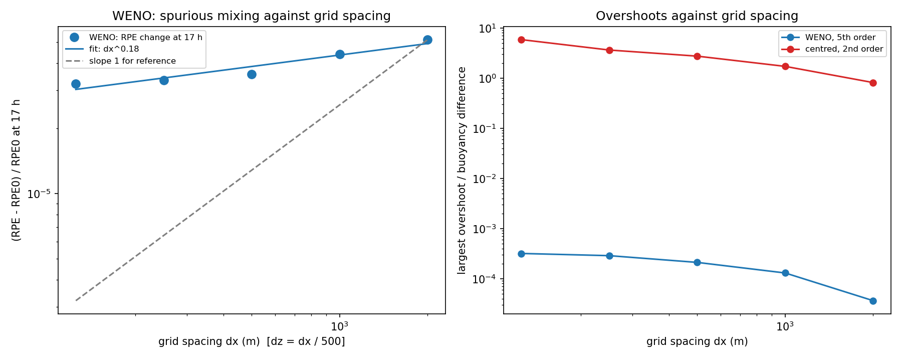
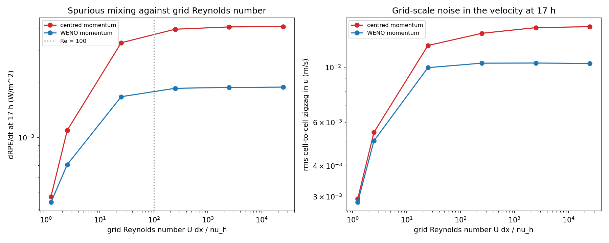
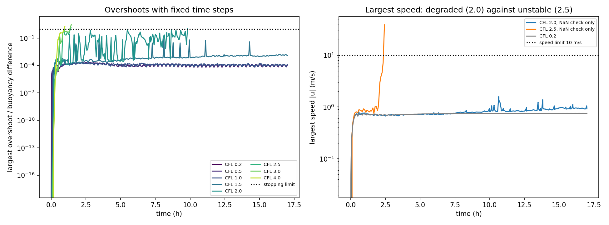
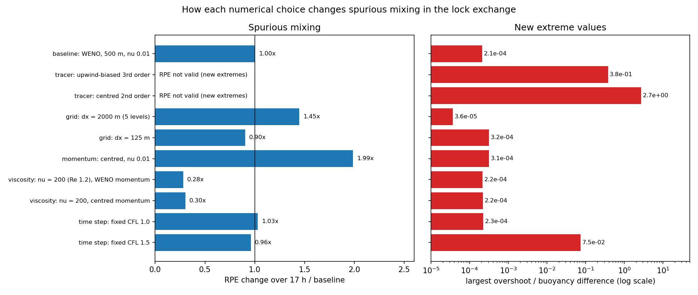

# 18. Numerical mixing in an ocean model: the lock-exchange test in Oceananigans.jl

How much artificial ("spurious") mixing do the numerical choices in an ocean model create? With zero explicit diffusivity, any mixing between two water masses can only come from the numerics. I use the lock-exchange test of Ilicak et al. (2012) in Oceananigans.jl to measure how the tracer advection scheme, the grid resolution, the viscosity and the time step change that mixing.

A step-by-step account of every choice and result is in [TUTORIAL.md](TUTORIAL.md). A plain-language guide to the whole project, from installing Julia to the conclusions, is in [docs/numerical mixing tutorial by OjashGiri.txt](<docs/numerical mixing tutorial by OjashGiri.txt>).

## Setup

- Oceananigans 0.113.5 on Julia 1.13.1, run on the CPU of a MacBook (M1). Analysis in Python 3.13 (numpy, pandas, xarray, matplotlib).
- Hydrostatic model (`HydrostaticFreeSurfaceModel`). The channel is 64 km long but only 20 m deep, so the flow is close to hydrostatic, and the models Ilicak et al. compared (MITgcm, MOM, GOLD and ROMS) are hydrostatic too.
- Lock exchange: a 2D channel (y-direction `Flat`), closed free-slip walls, no rotation. Dense water (b = 0) on the left half and light water (b = 0.04905 m/s^2, a density difference of 5 kg/m^3) on the right half, at rest. I use buoyancy directly instead of temperature; the density contrast is the same as in Ilicak et al.
- Baseline grid: dx = 500 m, dz = 1 m (128 x 20 cells). For the resolution tests dz is scaled with dx (dz = dx / 500).
- Zero explicit tracer diffusivity. Vertical viscosity 1e-4 m^2/s; lateral viscosity 1e-2 m^2/s in the baseline, up to 200 m^2/s in step 5.
- A fixed vertical grid and an implicit free surface with a gravity of 9.81e5 m/s^2 (in the free surface only). This stiff surface acts like a rigid lid, so total buoyancy is conserved to about 1e-8. Because the surface is implicit, its stiffness does not limit the time step: an explicit surface would need steps under 0.113 s at dx = 500 m, while the baseline used steps of up to 43.9 s.
- An adaptive time step (TimeStepWizard, CFL target 0.2), except in step 6. In this version the wizard's viscous limit treats the Flat y-direction as 1 m wide, so I switched that check off and passed the real viscous limit myself. A minimal example that reproduces this is in `simulations/mwe_flat_y_diffusion_timescale.jl` (not reported upstream).
- Each run lasts 17 hours of model time, the time Ilicak et al. used for their analysis.

## How I measured mixing

- Reference potential energy (RPE; Winters et al. 1995): sort all the water into the most stable possible state, without mixing it, and compute its potential energy. Only mixing can raise it. I report its change over 17 h (as a fraction of the starting RPE) and its rate of change at 17 h (dRPE/dt, in W/m^2).
- Buoyancy variance: mixing the two water masses lowers it.
- Overshoots: how far buoyancy goes beyond the starting range [0, 0.04905 m/s^2], as a fraction of the buoyancy difference. A monotone scheme should create none.
- Front speed: the speed of the dense current along the bottom from 3 to 15 h, against the theory of Benjamin (1968), 0.5 sqrt(g' H) = 0.4952 m/s.

## Notebooks

- `notebooks/01_setup_and_first_run.ipynb`: a tiny test run to check the chain from Julia to a plot in Python.
- `notebooks/02_lock_exchange_baseline.ipynb`: the baseline run (WENO, dx = 500 m): snapshots, front speed, RPE, variance and the checks.
- `notebooks/03_advection_schemes.ipynb`: centred (2nd order), upwind-biased (3rd order) and WENO (5th order) tracer advection compared.
- `notebooks/04_resolution.ipynb`: centred and WENO at dx = 2000, 1000, 500, 250 and 125 m.
- `notebooks/05_viscosity_and_grid_reynolds_number.ipynb`: lateral viscosity from 0.01 to 200 m^2/s (grid Reynolds number 24 761 to 1.24), with centred and with WENO momentum advection.
- `notebooks/06_time_step_and_stability.ipynb`: fixed time steps from CFL 0.2 to 4.0 and the adaptive time step.
- `notebooks/07_summary.ipynb`: all 34 runs in one table (`data/summary_all_runs.csv`), one summary figure and the conclusions.

## Main results

The tracer scheme decides whether the model invents new water masses. The centred scheme scatters cells of the wrong buoyancy through both layers, with values up to 2.7 buoyancy differences outside the starting range; WENO stays inside it (overshoots of 2e-4).

A finer grid helps little. Going 16 times finer (2000 m to 125 m) reduced the WENO mixing by a factor of only 1.6, while the centred scheme's overshoots grew from 0.8 to 5.8.

The mixing is flat ("capped") for grid Reynolds numbers above about 100 and falls below about 25: at Re = 1.24 it is 8.6 times smaller with centred momentum and 4.3 times smaller with WENO momentum. In the capped regime WENO momentum gives 2.15 times less mixing than centred momentum, and the grid-scale velocity noise follows the mixing.

Up to a CFL number of 1 the time step hardly matters. At CFL 1.5 WENO overshoots grow to 7.5e-2, at 2.0 the run survives but with overshoots of 3.3, and from 2.5 on it blows up.

All the choices side by side, against the baseline. The most spurious mixing came from a low viscosity with a non-dissipative momentum scheme (twice the baseline); the worst water masses came from the non-monotone tracer schemes. For those schemes the RPE is not a fair measure, because their new extremes lower it.

What this means for climate models: a long simulation runs for centuries and spurious mixing acts all the time. Mixing across the boundary between water masses weakens the stratification, and over centuries this can erode water-mass properties and change the deep density differences that drive the overturning circulation. My test shows the mechanism in a 2D, 17-hour setting; it does not measure the size of the effect in a climate model.

## Checks

- Front speed: 0.4793 m/s in the baseline against 0.4952 m/s from Benjamin (1968), 3.2% slower. Ilicak et al. also found the models slightly slower than theory.
- Buoyancy conservation: total buoyancy changed by at most 2.2e-8 (relative) in any of the 34 runs.
- Consistency: a passive tracer that starts at exactly 1 everywhere stayed at 1 to within 3e-15 in every run with CFL up to 1.0 (2.2e-16 in the baseline). It drifted only in the unstable time-step runs (1.3e-7 at CFL 2.0).
- RPE never decreasing: true for WENO in every run, apart from rounding-sized dips of about 1e-8 of the RPE. It fails for the centred and upwind-biased tracer schemes and for the CFL 2.0 run, whose overshoots create new extreme densities (Ilicak et al. 2012, Section 3.5). I flag those runs in the summary table rather than read their RPE as less mixing.

## Limitations

- 2D only: there is no third dimension for the interface to break up in, so the mixing is not that of a real 3D gravity current.
- One idealized test: a lock exchange with a linear equation of state, no rotation, no forcing and no topography.
- A CPU laptop: the finest grid was dx = 125 m (512 x 80 cells). Ilicak et al. also varied dx and dz separately; I scaled them together.
- Limited resolutions: dz = dx / 500 means the 2000 m run has only 5 vertical levels, so its interface is barely resolved and its RPE is noisy.
- Mixing measured with the RPE of snapshots every 10 minutes, not from the advection fluxes themselves. For non-monotone schemes the RPE underestimates the mixing.
- The stiff free surface and the fixed vertical grid differ from the z* coordinate used by MITgcm and MOM in Ilicak et al.
- Wall times include about 20 s of compiling for the first run of each script.

## How to reproduce

1. Install Julia (I used juliaup, Julia 1.13.1). From this folder, install the exact package versions in `Manifest.toml`:

       julia --project=. -e 'using Pkg; Pkg.instantiate()'

2. Run the scripts in order from this folder, for example `julia --project=. simulations/run_step2.jl`. Raw output goes to `~/oceananigans_runs/numerical_mixing/<run_name>/` (about 420 MB for all runs). All runs together take about 5 minutes of computing plus compiling.

       simulations/run_step1.jl ... simulations/run_step6.jl

3. Run the notebooks 01 to 07 in order with Python 3 and numpy, pandas, xarray (with a NetCDF backend), matplotlib and Jupyter. They read the raw output, and write the figures to `figures/` and the tables to `data/`.

## References

- Benjamin, T. B. (1968). Gravity currents and related phenomena. Journal of Fluid Mechanics, 31(2), 209-248.
- Winters, K. B., Lombard, P. N., Riley, J. J. and D'Asaro, E. A. (1995). Available potential energy and mixing in density-stratified fluids. Journal of Fluid Mechanics, 289, 115-128.
- Griffies, S. M., Pacanowski, R. C. and Hallberg, R. W. (2000). Spurious diapycnal mixing associated with advection in a z-coordinate ocean model. Monthly Weather Review, 128(3), 538-564. https://doi.org/10.1175/1520-0493(2000)128<0538:SDMAWA>2.0.CO;2
- Ilıcak, M., Adcroft, A. J., Griffies, S. M. and Hallberg, R. W. (2012). Spurious dianeutral mixing and the role of momentum closure. Ocean Modelling, 45-46, 37-58. https://doi.org/10.1016/j.ocemod.2011.10.003
- Ramadhan, A., Wagner, G. L., Hill, C., Campin, J.-M., et al. (2020). Oceananigans.jl: Fast and friendly geophysical fluid dynamics on GPUs. Journal of Open Source Software, 5(53), 2018. https://doi.org/10.21105/joss.02018
- Oceananigans.jl documentation: https://clima.github.io/OceananigansDocumentation/stable/
